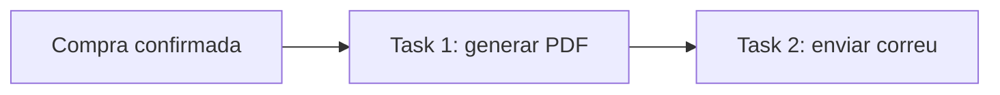

# Cadenes de Tasques amb Celery i django_q2

**Resum:** Aquesta guia explica el concepte de cadena de tasques (task chaining), quan té sentit usar-la i com implementar-la amb dues alternatives habituals a Django: **Celery** i **django_q2**. També inclou una comparativa de pros i contres per escollir l'opció adequada segons la complexitat del projecte.

**Índex de continguts:**
* [1. Què és una cadena de tasques?](#1-què-és-una-cadena-de-tasques)
* [2. Quan encadenar tasques](#2-quan-encadenar-tasques)
* [3. Implementació amb Celery (chain)](#3-implementació-amb-celery-chain)
* [4. Implementació amb django_q2 (Chain)](#4-implementació-amb-django_q2-chain)
* [5. Pros i contres](#5-pros-i-contres)
* [6. Recomanació pràctica](#6-recomanació-pràctica)

---

## 1. Què és una cadena de tasques?

Una **cadena de tasques** és un flux on una tasca només s'executa quan l'anterior ha acabat correctament.

Exemple típic en aquesta pràctica:
1. Generar PDF de la compra.
2. Enviar correu de confirmació amb la informació del PDF.

Si el PDF falla, normalment no té sentit enviar el correu.



## 2. Quan encadenar tasques

Encadenar tasques és útil quan:
* Hi ha **dependència de dades** entre passos (el correu necessita la ruta o metadades del PDF).
* Vols separar responsabilitats i poder **reintentar** cada pas.
* Necessites visibilitat del flux (on falla exactament).

No cal encadenar si:
* Les dues accions són molt simples i inseparables.
* No t'aporta valor operatiu dividir el procés.

## 3. Implementació amb Celery (chain)

Celery ofereix una primitiva nativa de workflow: `chain(...)`.

### Exemples de tasques

```python
# app/tasks.py
from celery import shared_task


@shared_task
def generar_pdf_compra(compra_id: int) -> str:
    pdf_path = f"/tmp/compra_{compra_id}.pdf"
    # ... generar PDF real ...
    return pdf_path


@shared_task
def enviar_mail_compra(pdf_path: str, compra_id: int) -> None:
    # ... enviar correu amb pdf_path ...
    return None
```

### Crear la cadena

```python
from celery import chain
from app.tasks import generar_pdf_compra, enviar_mail_compra

workflow = chain(
    generar_pdf_compra.s(compra_id),
    enviar_mail_compra.s(compra_id),
)
workflow.delay()
```

Idea clau:
* El resultat de `generar_pdf_compra` (per exemple `pdf_path`) es passa automàticament a la següent tasca.

## 4. Implementació amb django_q2 (Chain)

django_q2 permet construir una cadena de tasques amb `Chain`.

### Exemple de cadena

```python
from django_q.tasks import Chain

cadena = Chain()
cadena.add("myapp.tasks.tasca_A", arg1)
cadena.add("myapp.tasks.tasca_B")
cadena.run()
```

Aplicat al cas `PDF -> correu`:

```python
# app/tasks.py
def generar_pdf_compra(compra_id: int):
    pdf_path = f"/tmp/compra_{compra_id}.pdf"
    # ... generar PDF real ...
    # ... desar referencia a BD o a un magatzem compartit ...


def enviar_mail_compra(compra_id: int):
    # ... recuperar referencia del PDF a partir de compra_id ...
    # ... enviar correu ...
    pass
```

```python
# punt d'encuament
from django_q.tasks import Chain

cadena = Chain()
cadena.add("app.tasks.generar_pdf_compra", compra_id)
cadena.add("app.tasks.enviar_mail_compra", compra_id)
cadena.run()
```

Igual que amb Celery, la idea és separar passos i mantenir l'ordre d'execució del workflow.

## 5. Pros i contres

| Eina | Pros | Contres |
| :-- | :-- | :-- |
| Celery | Chain nativa, ecosistema madur, bon suport de reintents i routing, integració clara amb Redis/RabbitMQ | Més complexitat operativa inicial (broker + worker + monitorització) |
| django_q2 | Integració simple amb Django, corba d'entrada suau, suport de cadenes amb `Chain`, bona opció per projectes petits o mitjans | Ecosistema més petit i menys estàndard de facto que Celery en entorns grans |

## 6. Recomanació pràctica

Per aquesta pràctica:
* Si voleu entendre el concepte ràpidament: comenceu amb **django_q2 + Chain**.
* Si voleu aproximar-vos a un entorn industrial amb workflows més rics: useu **Celery**.

En tots dos casos, apliqueu el mateix principi que a la sessió 6:
* Enqueueu la primera tasca amb `on_commit(...)` per evitar condicions de cursa amb la transacció de checkout.
