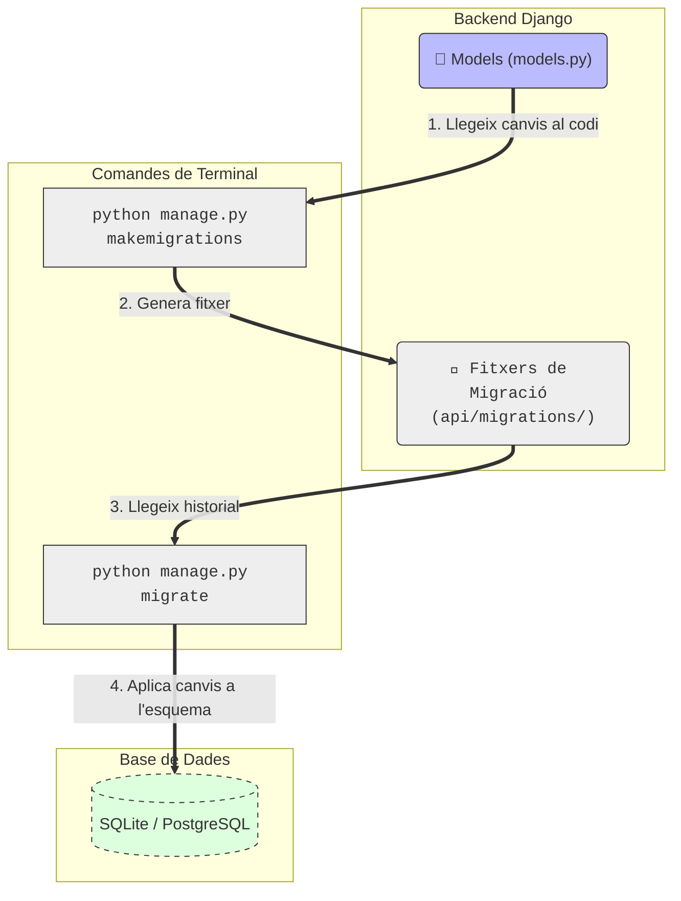
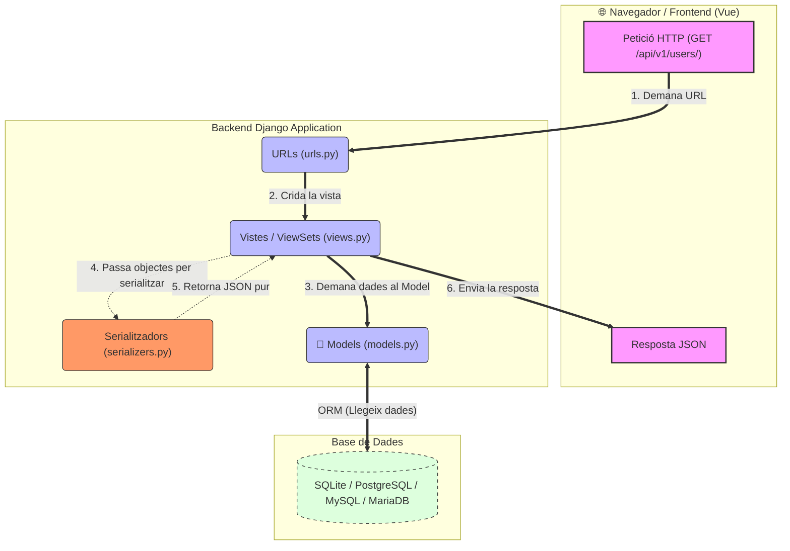
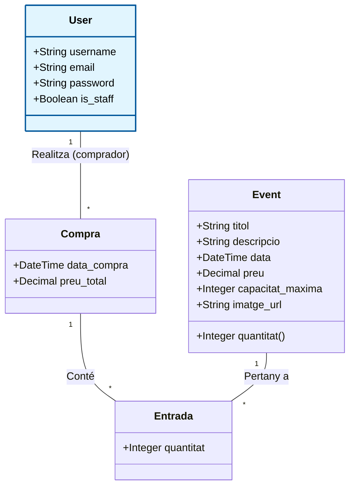

# Sessió 1: Fonaments del Backend i APIs

**Objectius de la sessió:**
* Entendre l'arquitectura base i l'estructura de directoris del projecte **TicketFlowUB**.
* Familiaritzar-se amb el flux de treball professional (Git, branques, Pull Requests i GitHub Actions).
* Comprendre el cicle de vida de les dades a Django (Model $\rightarrow$ Base de dades $\rightarrow$ API).
* Introduir el concepte de tests automàtics per assegurar la qualitat del codi.

**Guies relacionades:**
* 📖 [Primers passos Backend (Configuració i Entorn)](../backend/FirstSteps.md)
* 📖 [Primers passos Frontend (Configuració i Entorn)](../frontend/FirstSteps.md)
* 📖 [L'ORM de Django i els Models de Dades](../guies/django_models_orm.md)
* 📖 [Creant APIs amb Django REST Framework](../guies/drf_rest.md)
* 📖 [Flux de treball amb Git i CI/CD](../guies/flux_treball_git_ci.md)
* 📖 [Configuració i utilització de pytest amb Django i DRF](../guies/pytest_django_drf.md)

---

## 1. Estructura del Codi i Flux de Treball (GitHub)

El repositori que heu clonat des de **[GitHub Classrooms](https://classroom.github.com/)** conté l'esquelet del projecte configurat perquè pugueu començar a programar. Està dividit principalment en dues carpetes: `backend/` i `frontend/`. 

Per simular un entorn de desenvolupament real, seguirem un flux de treball col·laboratiu i automatitzat. *(Teniu tots els detalls explicats a la guia [Flux de treball amb Git i CI/CD](../guies/flux_treball_git_ci.md))*:

* **La branca `dev`:** Tot el desenvolupament actiu l'heu de fer en una branca de desenvolupament (ex: `dev`). Us recomanem crear-la tan bon punt cloneu el repositori. **No programeu directament sobre la branca `main`**.
* **Pull Requests (PR) setmanals:** Al final de cada sessió (o setmana), haureu d'obrir una *Pull Request* des de la vostra branca `dev` cap a la branca `main`. Això simula el procés de preparar una nova versió de l'aplicació.
* **Integració Contínua (GitHub Actions):** El repositori està preparat per executar automatitzacions (*workflows* de GitHub Actions). Quan obriu una Pull Request, els servidors de GitHub executaran automàticament els tests que hagueu escrit. Si els tests fallen, sabreu que no heu d'integrar el codi a `main` fins a arreglar-ho.

---

## 2. Introducció a les Tecnologies

Aquest projecte segueix una arquitectura Full-Stack moderna separant completament el client del servidor:

* **[Django](https://www.djangoproject.com/) i [Django REST Framework (DRF)](https://www.django-rest-framework.org/) (Backend):** Django ens proporciona un ORM potent per parlar amb la base de dades sense escriure SQL i un panell d'administració automàtic. Amb la capa de REST Framework, convertirem aquestes dades en format JSON perquè qualsevol client les pugui consumir.
* **[Vue.js](https://vuejs.org/) (Frontend):** S'encarregarà de consumir l'API de Django i dibuixar una interfície d'usuari reactiva (on la pantalla s'actualitza sense recarregar la pàgina).

---

## 3. Especificació del Problema: TicketFlowUB (Core)

Anem a desenvolupar **TicketFlowUB**, una plataforma de gestió i venda d'entrades per a esdeveniments. 
Per a aquesta part obligatòria (Core) del projecte, el sistema ha de permetre:
1.  **Gestió d'Usuaris:** El sistema ha de tenir usuaris registrats (administradors i clients).
2.  **Catàleg d'Esdeveniments:** S'han de poder donar d'alta esdeveniments. Cada esdeveniment tindrà un títol, una descripció, una data de celebració, un preu base i una capacitat màxima (aforament).
3.  **Registre de Compres (Cistella):** Els usuaris han de poder comprar entrades per a aquests esdeveniments. Una mateixa compra pot incloure entrades per a diferents esdeveniments i amb quantitats diferents. El sistema ha de registrar qui fa la compra, la data de la transacció, el preu total i el detall de les entrades adquirides per a cada esdeveniment.

*(Nota: Més endavant afegirem noves funcionalitats i rols, però començarem pel nucli central de l'aplicació).*

---

## 4. Treball al laboratori

En aquesta part presencial, treballarem de forma guiada per aixecar l'aplicació i exposar les primeres dades. **Utilitzarem el prefix `/api/v1/` a totes les nostres rutes** per suportar un correcte versionat.

### 4.1. Arrencada de l'entorn
Obre dues terminals al teu editor de codi (una per a la carpeta `backend/` i una per a `frontend/`).
1.  **Backend:** Situa't a la carpeta `backend/` i executa `uv sync`. Arrenca el servidor amb `uv run python manage.py runserver`. Accedeix a `http://localhost:8000`.
2.  **Frontend:** Situa't a la carpeta `frontend/` i executa `npm install`. Arrenca el servidor amb `npm run dev`. Accedeix a `http://localhost:5173`.

### 4.2. La Base de Dades Inicial

El **Flux de Disseny de Base de Dades** consisteix en el camí per traslladar els canvis que fas al teu codi Python a l'estructura real de la base de dades:

1. **Models** (```models.py```): Tu defineixes o modifiques una classe Python (ex: afegeixes un model per guardar un ```Event``` o simplement l'hi afegeixes un nou atribut).

2. ```makemigrations```: Django llegeix el teu codi i genera un fitxer intermedi (a la carpeta migrations/) que descriu aquest canvi.

3. ```migrate```: Django llegeix aquest fitxer de migració i executa el codi SQL necessari a la Base de Dades real per actualitzar la taula."



Anem a posar-ho a prova. Des d'una terminal obre la carpeta del **backend**. Ara aplica les migracions inicials que preparen les taules internes de Django (com la dels usuaris i permisos) i crea el teu compte d'administrador:
```bash
uv run python manage.py migrate
uv run python manage.py createsuperuser
```

**Nota:** Pots utilitzar un client per connectar a la base de dades i comprovar que realment s'ha creat un nou usuari a la taula ```users```. 


### 4.3. El primer Endpoint: Usuaris

Un dels models que DJango ens dona ja implementat és el model ```User```, que conté tota la informació d'un usuari. Amb els passos anteriors ja hem vist com crear la taula corresponent a la base de dades per aquest model i hi hem afegit un nou registre. Per exposar aquest model per a que pugui ser utilitzat, cal entendre el **cicle de Petició/Resposta** de DJango. El diagrama següent mostra com el camí que segueix una petició d'un usuari des que envia una petició des del navegador web fins a que veu les dades:

1.  **Navegador (Client):** Fa una petició HTTP (ex: `GET /api/v1/users/`).
2.  **URLs (`urls.py`):** Llegeix la URL i decideix quina Vista ha de gestionar-la.
3.  **Vistes (`views.py`):** Són el cervell. Demanen dades al Model.
4.  **Models (`models.py`):** Llegeixen de la Base de Dades usant l'ORM (sense escriure SQL).
5.  **Serialitzadors (`serializers.py`):** (Específic de DRF) Agafen els objectes complexos de Python que ha retornat el model i els converteixen en un simple text en format JSON.
6.  **Vistes:** Agafen aquest JSON i el retornen al Navegador en forma de resposta HTTP.



Vegem pas a pas com exposar el model d'Usuari (```User```) que Django porta per defecte en una URL concreta. L'aplicació on treballarem ja està creada a la plantilla inicial de l'assignatura i es diu `api`. Anem a veure com definir els diferents components explicats anteriorment:

**Pas 1:** Obre l'arxiu `backend/api/serializers.py` (si no existeix l'has de crear) i afegeix el codi per convertir el model a JSON:
```python
from rest_framework import serializers
from django.contrib.auth.models import User

class UserSerializer(serializers.ModelSerializer):
    class Meta:
        model = User
        fields = '__all__'
        read_only_fields = ['last_login', 'date_joined']
```

Aquest codi defineix un serialitzador basat en el model d'usuaris (`User`) que Django porta integrat per defecte. Utilitzem `ModelSerializer` perquè s'encarregui automàticament de traduir les dades d'aquests usuaris de la base de dades a format JSON (i viceversa). L'atribut `fields = '__all__'` li indica que volem incloure absolutament tots els camps (com el nom, l'email o la contrasenya) a la nostra API. Més endavant, potser voldreu canviar el `__all__` per una llista específica de camps com `['id', 'username', 'email']` per motius de seguretat i no exposar les contrasenyes xifrades, però deixem-ho simple per començar. L'opció `read_only_fields` fa que aquests camps només es puguin llegir, i que l'usuari no els pugui canviar.


**Pas 2:** A l'arxiu `backend/api/views.py`, crea la vista per gestionar les peticions:
```python
from rest_framework import viewsets
from django.contrib.auth.models import User
from .serializers import UserSerializer

class UserViewSet(viewsets.ModelViewSet):
    queryset = User.objects.all()
    serializer_class = UserSerializer
```

Aquest codi crea el controlador de l'API per als usuaris utilitzant un `ModelViewSet`, la qual cosa genera automàticament totes les operacions estàndard **CRUD** (crear, llegir, actualitzar i esborrar) sense haver de programar-les a mà. Només li hem d'indicar d'on ha de treure la informació de la base de dades (`queryset`) i quin traductor JSON ha d'utilitzar (`serializer_class`).

**Pas 3:** A l'arxiu `backend/api/urls.py`, registra la ruta de l'API:
```python
from django.urls import path, include
from rest_framework.routers import DefaultRouter
from .views import UserViewSet

router = DefaultRouter()
router.register(r'users', UserViewSet)

urlpatterns = [
    path('api/v1/', include(router.urls)),
]
```
Finalment, en aquest codi es configura automàticament totes les adreces (URLs) per gestionar els usuaris utilitzant un enrutador de tipus `DefaultRouter`. En lloc d'escriure cada ruta a mà, l'enrutador genera les URLs estàndard de l'API (com `/api/v1/users/` per llistar o crear) a partir del `UserViewSet` i les connecta al sistema principal de Django.

**Pas 4: Experimenta!**
Obre el navegador i visita `http://localhost:8000/api/v1/users/`. Veuràs tota la informació del superusuari que has creat abans, incloent camps interns.

**Prova de canviar:** Al fitxer `backend/api/serializers.py`, canvia `fields = '__all__'` per `fields = ['id', 'username', 'email']`. Guarda l'arxiu i recarrega la pàgina del navegador. *Quin efecte ha tingut? Per què creus que en el món real és perillós utilitzar `__all__` en dades sensibles?*

### 4.4. El Model de Domini: Event

Ara crearem el nostre propi model. Al fitxer `backend/api/models.py`, afegeix:

```python
from django.db import models

class Event(models.Model):
    titol = models.CharField(max_length=200)
    descripcio = models.TextField()
    data = models.DateTimeField(null=False, blank=False)
    preu = models.DecimalField(max_digits=8, decimal_places=2)
    capacitat_maxima = models.IntegerField()

    def __str__(self):
        return self.titol
```

*Fixa't en les opcions principals:* **En heretar de `models.Model`**, li estem donant instruccions directes a l'ORM (Object-Relational Mapper) de Django perquè converteixi aquesta classe de Python en una taula real a la base de dades. Assignem tipus de dades específics (text, decimals amb 2 xifres, enters) perquè la base de dades sàpiga com guardar cada columna de forma òptima. Finalment, la funció `__str__` defineix com es llegirà l'esdeveniment de forma amigable (tant a la terminal com al futur panell d'administració de Django).

> **L'abisme entre el Codi i la Base de Dades:**
>
> Tal com hem vist al diagrama del flux de desenvolupament, ara mateix has escrit el teu model en Python, però la base de dades encara no en sap absolutament res. Anem a posar en pràctica el cicle de migracions per creuar aquest abisme:
>
> 1. **Prepara les instruccions:** Executa `uv run python manage.py makemigrations`. Això llegeix el teu nou model `Event` i genera l'arxiu d'instruccions (el pas intermedi del diagrama).
> 2. **Explora:** Ves a la carpeta `api/migrations/` i obre l'arxiu `0001_initial.py` que s'acaba de crear. Observa com Django ha traduït la teva classe a operacions estructurades, llestes per ser executades.
> 3. **Aplica-ho a la Base de Dades:** Executa `uv run python manage.py migrate`. Aquest pas agafa l'arxiu anterior i executa l'SQL necessari per crear la taula definitiva a la base de dades real.


### 4.5 El Panell d'Administració de Django

Django incorpora una potent interfície d'administració autogenerada (accessible a través de la ruta `/admin`). Aquesta vista integrada ens permet interactuar directament amb els registres dels nostres models —creant, modificant o eliminant dades— sense la necessitat de recórrer a clients SQL o altres eines de base de dades externes. Cal tenir en compte, però, que per raons de disseny i seguretat, els models de nova creació no s'hi exposen automàticament; per poder gestionar-los des d'aquest panell, és indispensable registrar-los de forma explícita al fitxer corresponent.

En el codi base que us hem proporcionat, aquest entorn d'administració ja ve activat per defecte. Us animem a obrir el fitxer `backend/config/settings.py` per comprovar com està inclòs dins l'apartat d'aplicacions instal·lades (`INSTALLED_APPS`), així com el fitxer `backend/config/urls.py`, on veureu com s'ha registrat la ruta principal cap a `/admin/`. Per tant, ara només ens falta indicar-li que també hi volem veure el nostre nou model:

```python
from django.contrib import admin
from .models import Event

admin.site.register(Event)
```

Accedeix a `http://localhost:8000/admin`, fes login amb el teu superusuari i crea un parell d'esdeveniments manualment.

### 4.6. L'API de l'Event

Finalment, repeteix els passos de la secció 4.3 (Serializer, ViewSet i Router) però per al model `Event`, modificant `backend/api/serializers.py`, `backend/api/views.py` i `backend/api/urls.py` de manera que quedi publicat a la ruta `/api/v1/events/`.

Bona idea! En Markdown estàndard no podem pintar el fons directament, però si esteu penjant aquesta guia a GitHub, GitLab, o algun sistema que suporti el Markdown modern, la millor manera de crear una caixa d'alerta amb tons vermellosos és utilitzant l'etiqueta `[!CAUTION]` o `[!WARNING]`.

Aquí tens com quedaria el codi exacte per generar aquesta caixa d'avís perquè ressalti moltíssim:

> [!CAUTION]
> 🐛 **Avís important: Convivint amb els *bugs* del món real**
> 
> En el desenvolupament de programari professional, sovint ens trobem amb errors que no són nostres, sinó de les llibreries que utilitzem. Actualment, hi ha un [*bug* obert i documentat](https://github.com/encode/django-rest-framework/issues/9927) a la darrera versió de Django REST Framework (DRF) que afecta directament el model que acabeu de crear.
> 
> **Quin és el problema?**
> El problema no rau en l'API en si mateixa (la recepció i enviament de dades JSON funciona perfectament), sinó en com el DRF "pinta" la interfície web de forma amigable (la *Browsable API*). Quan la pàgina intenta dibuixar el formulari HTML amb un selector de dates (*date picker*) buit per crear un nou esdeveniment, el sistema no sap interpretar aquest buit i s'estavella amb l'error `Invalid isoformat string: ''`.
> 
> Per continuar, heu d'aplicar **una** d'aquestes dues solucions:
> 
> * **Opció A: Fixar una versió anterior (Downgrade)**
>     Podem forçar el projecte a utilitzar una versió prèvia de DRF on aquest error encara no existia. Aneu al fitxer `pyproject.toml`, cerqueu les dependències i canvieu la línia de DRF perquè sigui exactament: `"djangorestframework>=3.15,<3.17"`. Un cop desat l'arxiu, executeu `uv sync` a la terminal per actualitzar l'entorn.
> 
> * **Opció B: Modificar la interfície visual (Workaround)**
>     Podem dir-li al DRF que no intenti pintar el selector de dates conflictiu. Aneu al fitxer `serializers.py` i afegiu aquesta configuració al vostre `EventSerializer` perquè utilitzi una caixa de text estàndard:
>     ```python
>     class EventSerializer(serializers.ModelSerializer):
>         data = serializers.DateTimeField(style={"input_type": "text"})
>         
>         class Meta:
>             model = Event
>             fields = '__all__'
>     ```

### 4.7. Proves inicials i el Flux de Proves automatizades

El projecte que us hem facilitat conté una carpeta `backend/api/tests` on podeu anar definint les vostres proves. Inicialment hi ha unes proves molt simples per assegurar que tot el sistema de CI/CD de GitHub funciona correctament (podeu revisar el fitxer `test_setup.py` d'aquest directori).

Abans d'escriure la nostra primera prova real, és important entendre **el flux d'una prova automatitzada**. Tota bona prova unitària segueix un patró clàssic de tres passos (sovint conegut com a *Arrange-Act-Assert*):

1. **Preparar (Arrange):** Definim les dades de la prova i la URL que rebrà la petició.
2. **Executar (Act):** Simulem l'acció de l'usuari (per exemple, enviar una petició `POST` a l'API per crear un nou usuari).
3. **Comprovar (Assert):** Verifiquem que la resposta de l'API i l'estat final de la base de dades són exactament els que esperàvem.

Anem a traduir aquest flux en codi creant una prova per al model `User`. Escriu aquesta prova automatitzada al fitxer `backend/api/tests/test_users.py`:

```python
from rest_framework.test import APITestCase
from rest_framework import status
from django.contrib.auth.models import User

class UserAPITests(APITestCase):
    def test_create_user(self):
        # 1. PREPARAR: Definim on enviem les dades i quines són
        url = '/api/v1/users/'
        data = {'username': 'testuser', 'password': 'testpassword123'}
        
        # 2. EXECUTAR: Simulem la petició POST cap a l'API
        response = self.client.post(url, data, format='json')
        
        # 3. COMPROVAR: Verifiquem els resultats
        # Comprovem que l'API respon amb un codi "201 Created"
        self.assertEqual(response.status_code, status.HTTP_201_CREATED)
        # Comprovem que l'usuari s'ha creat realment a la base de dades
        self.assertEqual(User.objects.count(), 1)
        self.assertEqual(User.objects.get().username, 'testuser')
```

**Executant els tests:**
Obre la teva terminal al directori `backend/` i executa la comanda següent:
```bash
uv run python manage.py test
```
Veuràs que s'executa el test i finalitza amb un "OK". 


**Reflexió:** 
Què passa si executes la mateixa comanda de test dos cops seguits? Donarà error dient que l'usuari "testuser" ja existeix? 

*Prova-ho! Veuràs que no falla. Això és perquè Django genera una base de dades temporal exclusivament per als tests totalment buida, executa les proves i, en acabar, la destrueix. Així es garanteix que els teus tests siguin aïllats i reproduïbles.*

**Evolucionant cap a eines professionals:** 
En l'exemple anterior hem utilitzat la classe `APITestCase`, que és l'eina integrada per defecte a Django REST Framework. És ideal per començar, però teniu més opcions. Podeu consultar la [**guia sobre com configurar i utilitzar `pytest` amb Django i DRF**](../guies/pytest_django_drf.md), que serà l'eina de *testing* que us recomanem utilitzar per a la resta d'aquesta pràctica.

---

## 5. Treball fora del laboratori

Ara que ja coneixes el flux complet (Model $\rightarrow$ Migració $\rightarrow$ Serialitzador $\rightarrow$ ViewSet $\rightarrow$ Router), has de completar el domini de dades obligatori de l'aplicació i preparar el codi per a la teva primera Pull Request.

A continuació es mostra el diagrama de classes d'aquesta part del projecte. **Fixa't que la classe `User` (en blau) ja ens la proporciona Django**, i que **Event** ja s'ha definit (tot i que no exactament igual).



**Tasques a realitzar:**
1.  **Models de Compra i Entrada:** Crea els models `Compra` i `Entrada` a `backend/api/models.py`. Has de definir correctament les relacions a la base de dades:
    * Una `Compra` és realitzada per un únic `User` (afegeix un camp `ForeignKey` a `Compra` relacionant-la amb el model `User`).
    * Una `Entrada` pertany a una única `Compra` i correspon a un únic `Event` (afegeix **dues** `ForeignKey` a la classe `Entrada`: una relacionant-la amb `Compra` i l'altra amb `Event`). Tingues en compte que per cada `Entrada` s'ha d'especificar quantes unitats s'inclouen a la `Compra` (camp **quantitat**).
    * Al model `Event`, crea un mètode o propietat anomenada **capacitat** que retorni les places disponibles actualment (és a dir, la **capacitat_maxima** de l'esdeveniment menys la **suma de les quantitats de totes les entrades venudes** per a aquell esdeveniment). Investiga a la documentació de Django REST Framework com pots fer que aquest valor calculat aparegui al JSON quan consultis els esdeveniments (**Pista:** busca informació sobre `SerializerMethodField` o com serialitzar una `@property`).

2.  **Migracions:** Genera i aplica les migracions per aquests nous models, i registra'ls a `backend/api/admin.py`.
3.  **Endpoints de l'API:** Crea els `Serialitzadors` i `ViewSets` per als nous models i exposa'ls a `backend/api/urls.py` sota els prefixos `/api/v1/compres/` i `/api/v1/entrades/`.
4.  **Afegir imatge a l'esdeveniment:** Un sistema de venda d'entrades no seria gaire atractiu si els esdeveniments no tinguessin un cartell o una imatge promocional. Us proposem afegir la capacitat de vincular una imatge a cada `Event`. Com a mínim caldrà que existeixi un enllaç a la imatge (pots mirar la documentació de [URLField](https://docs.djangoproject.com/en/6.0/ref/models/fields/#urlfield). Opcionalment, al final de l'enunciat us proposem un repte una mica més gran.
5.  **Tests:** Afegeix un test al fitxer `backend/api/tests.py` que verifiqui que es pot crear un `Event` correctament a través de l'API fent un `POST` a `/api/v1/events/`. A més, afegeix un test per verificar la creació d'una `Entrada` assignant-li una quantitat, i comprova que, un cop creada, la `capacitat` de l'esdeveniment s'ha reduït correctament, i que no es poden comprar més entrades de les disponibles.
6.  **Verificació Local:** Abans de pujar el codi, executa `uv run python manage.py test` a la teva terminal local per confirmar que tant el test antic com el nou passen amb èxit.
7.  **Pull Request:** Fes un `commit` amb tots els teus canvis, puja'ls a la teva branca `dev` (`git push origin dev`) i obre una Pull Request cap a la branca `main`. Les GitHub Actions executaran de nou els tests al núvol.

---

## 6. Documentació Oficial i Recursos

Si et quedes encallat o vols aprofundir en com funciona alguna d'aquestes eines internament, consulta la documentació oficial:

* [Django Documentation: Models i Camps](https://docs.djangoproject.com/en/stable/topics/db/models/)
* [Django REST Framework: Serialitzadors](https://www.django-rest-framework.org/api-guide/serializers/)
* [Django REST Framework: ViewSets i Routers](https://www.django-rest-framework.org/api-guide/viewsets/)
* [Django Testing Tools](https://docs.djangoproject.com/en/stable/topics/testing/tools/)
* [GitHub Flow: Com treballar amb branques i PRs](https://docs.github.com/en/get-started/using-github/github-flow)

## 7. *[OPCIONAL]* Posant cara als esdeveniments (Imatges)

A la vida real, sovint volem que l'usuari pugui pujar la imatge des del seu ordinador directament al nostre servidor. Django té un camp especialitzat per a això anomenat `ImageField`. Aquest repte requereix una mica més de configuració, però us ensenyarà com es gestionen els fitxers multimèdia professionals (coneguts com a *Media Files*).

Si trieu aquest repte, haureu de seguir aquests passos:

1.  **Instal·lar la llibreria de processament d'imatges:**
    Django necessita la llibreria `Pillow` per poder validar i processar imatges. Instal·leu-la al vostre entorn:

    ```bash
    uv add Pillow
    ```

2.  **Modificar el model `Event`:**
    En lloc d'un `URLField`, utilitzareu un [`ImageField`](https://docs.djangoproject.com/en/6.0/ref/models/fields/#imagefield). Aquest camp requereix indicar a quina subcarpeta es guardaran les imatges.

    ```python
    imatge = models.ImageField(upload_to='events/imatges/', null=True, blank=True)
    ```

    *(Recordeu fer `makemigrations` i `migrate` després d'aquest canvi).*

3.  **Configurar l'emmagatzematge al `settings.py`:**
    Heu de dir-li a Django on ha de guardar físicament aquests fitxers al vostre disc dur i quina serà la URL base per accedir-hi. Afegiu això al final del vostre `backend/config/settings.py`:

    ```python
    import os
    # URL pública base per a les imatges
    MEDIA_URL = '/media/'
    # Carpeta física on es guardaran
    MEDIA_ROOT = os.path.join(BASE_DIR, 'media')
    ```

4.  **Exposar les imatges a la web (Només en desenvolupament):**
    Per defecte, l'eina de desenvolupament de Django no serveix fitxers multimèdia per motius de seguretat i rendiment. Per poder veure les imatges que pugeu mentre programeu, heu d'afegir una excepció al fitxer d'enrutament principal (`backend/config/urls.py`):

    ```python
    from django.conf import settings
    from django.conf.urls.static import static

    urlpatterns = [
        # ... les vostres rutes actuals ...
    ]

    # Afegim aquesta línia al final:
    if settings.DEBUG:
        urlpatterns += static(settings.MEDIA_URL, document_root=settings.MEDIA_ROOT)
    ```

**La màgia de DRF:** Si opteu per aquest repte, veureu que el Django REST Framework és molt intel·ligent. Sense que toqueu res del vostre `EventSerializer`, quan feu una petició a l'API, DRF us retornarà automàticament la URL completa i funcional de la imatge que hàgiu pujat\!

**📚 Referències oficials per al repte:**

  * [Django Model field reference: ImageField](https://www.google.com/search?q=https://docs.djangoproject.com/en/5.0/ref/models/fields/%23imagefield)
  * [Managing files in Django](https://docs.djangoproject.com/en/5.0/topics/files/)
  * [Serving files uploaded by a user during development](https://www.google.com/search?q=https://docs.djangoproject.com/en/5.0/howto/static-files/%23serving-files-uploaded-by-a-user-during-development)
