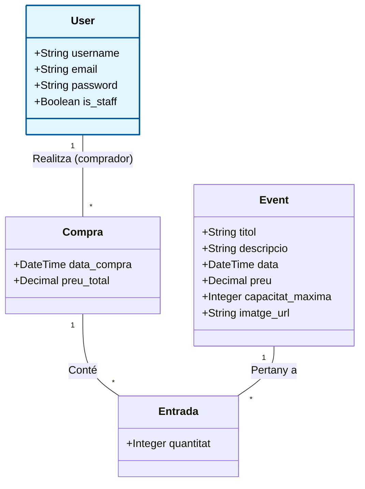

# Sessió 1: Fonaments del Backend i APIs

**Objectius de la sessió:**
* Entendre l'arquitectura base i l'estructura de directoris del projecte **TicketFlowUB**.
* Familiaritzar-se amb el flux de treball professional (Git, branques, Pull Requests i GitHub Actions).
* Comprendre el cicle de vida de les dades a Django (Model $\rightarrow$ Base de dades $\rightarrow$ API).
* Introduir el concepte de tests automàtics per assegurar la qualitat del codi.

**Guies relacionades:**
* 📖 [Primers passos Backend (Configuració i Entorn)](../backend/FirstSteps.md)
* 📖 [Primers passos Frontend (Configuració i Entorn)](../frontend/FirstSteps.md)
* 📖 [L'ORM de Django i els Models de Dades](../guies/django_models_orm.md)
* 📖 [Creant APIs amb Django REST Framework](../guies/drf_rest.md)
* 📖 [Flux de treball amb Git i CI/CD](../guies/flux_treball_git_ci.md)

---

## 1. Estructura del Codi i Flux de Treball (GitHub)

El repositori que heu clonat des de **[GitHub Classrooms](https://classroom.github.com/)** conté l'esquelet del projecte configurat perquè pugueu començar a programar. Està dividit principalment en dues carpetes: `backend/` i `frontend/`. 

Per simular un entorn de desenvolupament real, seguirem un flux de treball col·laboratiu i automatitzat. *(Teniu tots els detalls explicats a la guia [Flux de treball amb Git i CI/CD](../guies/flux_treball_git_ci.md))*:

* **La branca `dev`:** Tot el desenvolupament actiu l'heu de fer en una branca de desenvolupament (ex: `dev`). Us recomanem crear-la tan bon punt cloneu el repositori. **No programeu directament sobre la branca `main`**.
* **Pull Requests (PR) setmanals:** Al final de cada sessió (o setmana), haureu d'obrir una *Pull Request* des de la vostra branca `dev` cap a la branca `main`. Això simula el procés de preparar una nova versió de l'aplicació.
* **Integració Contínua (GitHub Actions):** El repositori està preparat per executar automatitzacions (*workflows* de GitHub Actions). Quan obriu una Pull Request, els servidors de GitHub executaran automàticament els tests que hagueu escrit. Si els tests fallen, sabreu que no heu d'integrar el codi a `main` fins a arreglar-ho.

---

## 2. Introducció a les Tecnologies

Aquest projecte segueix una arquitectura Full-Stack moderna separant completament el client del servidor:

* **[Django](https://www.djangoproject.com/) i [Django REST Framework (DRF)](https://www.django-rest-framework.org/) (Backend):** Django ens proporciona un ORM potent per parlar amb la base de dades sense escriure SQL i un panell d'administració automàtic. Amb la capa de REST Framework, convertirem aquestes dades en format JSON perquè qualsevol client les pugui consumir.
* **[Vue.js](https://vuejs.org/) (Frontend):** S'encarregarà de consumir l'API de Django i dibuixar una interfície d'usuari reactiva (on la pantalla s'actualitza sense recarregar la pàgina).

---

## 3. Especificació del Problema: TicketFlowUB (Core)

Anem a desenvolupar **TicketFlowUB**, una plataforma de gestió i venda d'entrades per a esdeveniments. 
Per a aquesta part obligatòria (Core) del projecte, el sistema ha de permetre:
1.  **Gestió d'Usuaris:** El sistema ha de tenir usuaris registrats (administradors i clients).
2.  **Catàleg d'Esdeveniments:** S'han de poder donar d'alta esdeveniments. Cada esdeveniment tindrà un títol, una descripció, una data de celebració, un preu base i una capacitat màxima (aforament).
3.  **Registre de Compres (Cistella):** Els usuaris han de poder comprar entrades per a aquests esdeveniments. Una mateixa compra pot incloure entrades per a diferents esdeveniments i amb quantitats diferents. El sistema ha de registrar qui fa la compra, la data de la transacció, el preu total i el detall de les entrades adquirides per a cada esdeveniment.

*(Nota: Més endavant afegirem rols avançats com l'Organitzador d'esdeveniments, però començarem pel nucli central de l'aplicació).*

---

## 4. Treball al laboratori

En aquesta part presencial, treballarem de forma guiada per aixecar l'aplicació i exposar les primeres dades. **Utilitzarem el prefix `/api/v1/` a totes les nostres rutes** per suportar un correcte versionat.

### 4.1. Arrencada de l'entorn
Obre dues terminals al teu editor de codi (una per a la carpeta `backend/` i una per a `frontend/`).
1.  **Backend:** Situa't a la carpeta `backend/` i executa `uv sync`. Arrenca el servidor amb `uv run python manage.py runserver`. Accedeix a `http://localhost:8000`.
2.  **Frontend:** Situa't a la carpeta `frontend/` i executa `npm install`. Arrenca el servidor amb `npm run dev`. Accedeix a `http://localhost:5173`.

### 4.2. La Base de Dades Inicial
Des de la terminal del backend, aplica les migracions inicials que preparen les taules internes de Django (com la dels usuaris i permisos) i crea el teu compte d'administrador:
```bash
uv run python manage.py migrate
uv run python manage.py createsuperuser
```

### 4.3. El primer Endpoint: Usuaris
Anem a exposar el model d'Usuari que Django porta per defecte. L'aplicació on treballarem ja està creada a la plantilla inicial de l'assignatura i es diu `api`.

**Pas 1:** Obre l'arxiu `backend/api/serializers.py` i afegeix el codi per convertir el model a JSON:
```python
from rest_framework import serializers
from django.contrib.auth.models import User

class UserSerializer(serializers.ModelSerializer):
    class Meta:
        model = User
        fields = '__all__'
```

**Pas 2:** A l'arxiu `backend/api/views.py`, crea la vista per gestionar les peticions:
```python
from rest_framework import viewsets
from django.contrib.auth.models import User
from .serializers import UserSerializer

class UserViewSet(viewsets.ModelViewSet):
    queryset = User.objects.all()
    serializer_class = UserSerializer
```

**Pas 3:** A l'arxiu `backend/api/urls.py`, registra la ruta de l'API:
```python
from django.urls import path, include
from rest_framework.routers import DefaultRouter
from .views import UserViewSet

router = DefaultRouter()
router.register(r'users', UserViewSet)

urlpatterns = [
    path('api/v1/', include(router.urls)),
]
```

**Pas 4: Experimenta!**
Obre el navegador i visita `http://localhost:8000/api/v1/users/`. Veuràs tota la informació del superusuari que has creat abans, incloent camps interns.
👉 **Prova de canviar:** Al fitxer `backend/api/serializers.py`, canvia `fields = '__all__'` per `fields = ['id', 'username', 'email']`. Guarda l'arxiu i recarrega la pàgina del navegador. *Quin efecte ha tingut? Per què creus que en el món real és perillós utilitzar `__all__` en dades sensibles?*

### 4.4. El Model de Domini: Event

Ara crearem el nostre propi model. Al fitxer `backend/api/models.py`, afegeix:

```python
from django.db import models

class Event(models.Model):
    titol = models.CharField(max_length=200)
    descripcio = models.TextField()
    data = models.DateTimeField()
    preu = models.DecimalField(max_digits=8, decimal_places=2)
    capacitat_maxima = models.IntegerField()

    def __str__(self):
        return self.titol
```
*Fixa't en les opcions principals:* Assignem tipus de dades específics (text, decimals amb 2 xifres, enters) perquè la base de dades sàpiga com guardar-ho de forma òptima. La funció `__str__` simplement defineix com es llegirà l'esdeveniment a la terminal.

**L'abisme entre el Codi i la Base de Dades:**
Ara mateix has escrit codi en Python, però la base de dades SQL no sap que aquesta taula existeix.
1. Executa `uv run python manage.py makemigrations`. Això "llegeix" el teu codi i genera un arxiu d'instruccions per a la base de dades.
2. 👉 **Explora:** Ves a la carpeta `backend/api/migrations/` i obre l'arxiu `0001_initial.py` que s'acaba de crear. Observa com Django ha traduït les teves classes a operacions estructurades.
3. Executa `uv run python manage.py migrate` per aplicar finalment els canvis a la base de dades real.

**El Panell d'Administració de Django:**
Django incorpora un CMS complet gratuït (al qual pots accedir via `/admin`). Però per defecte, no hi mostra els teus models nous. Has de registrar-los explícitament al fitxer `backend/api/admin.py`:

```python
from django.contrib import admin
from .models import Event

admin.site.register(Event)
```
Accedeix a `http://localhost:8000/admin`, fes login amb el teu superusuari i crea un parell d'esdeveniments manualment.

**L'API de l'Event:**
Finalment, repeteix els passos de la secció 4.3 (Serializer, ViewSet i Router) però per al model `Event`, modificant `backend/api/serializers.py`, `backend/api/views.py` i `backend/api/urls.py` de manera que quedi publicat a la ruta `/api/v1/events/`.

### 4.5. Testing inicial
Al fitxer `backend/api/tests.py`, escriu aquest test automatitzat que simula una petició `POST` per crear un usuari mitjançant l'API:

```python
from rest_framework.test import APITestCase
from rest_framework import status
from django.contrib.auth.models import User

class UserAPITests(APITestCase):
    def test_create_user(self):
        url = '/api/v1/users/'
        data = {'username': 'testuser', 'password': 'testpassword123'}
        
        # Simulem la petició POST
        response = self.client.post(url, data, format='json')
        
        # Comprovem que l'API respon amb "201 Created"
        self.assertEqual(response.status_code, status.HTTP_201_CREATED)
        # Comprovem que l'usuari s'ha guardat efectivament a la BD
        self.assertEqual(User.objects.count(), 1)
        self.assertEqual(User.objects.get().username, 'testuser')
```

**Executant els tests:**
Obre la teva terminal al directori `backend/` i executa la comanda següent:
```bash
uv run python manage.py test
```
Veuràs que s'executa el test i finalitza amb un "OK". 

👉 **Reflexió:** Què passa si executes la mateixa comanda de test dos cops seguits? Donarà error dient que l'usuari "testuser" ja existeix? 
*Prova-ho! Veuràs que no falla. Això és perquè Django genera una base de dades temporal exclusivament per als tests totalment buida, executa les proves i, en acabar, la destrueix. Així es garanteix que els teus tests siguin aïllats i reproduïbles.*

---

## 5. Treball fora del laboratori

Ara que ja coneixes el flux complet (Model $\rightarrow$ Migració $\rightarrow$ Serialitzador $\rightarrow$ ViewSet $\rightarrow$ Router), has de completar el domini de dades obligatori de l'aplicació i preparar el codi per a la teva primera Pull Request.

A continuació es mostra el diagrama de classes d'aquesta part del projecte. **Fixa't que la classe `User` (en blau) ja ens la proporciona Django**.



**Tasques a realitzar:**
1.  **Models de Compra i Entrada:** Crea els models `Compra` i `Entrada` a `backend/api/models.py`. Has de definir correctament les relacions a la base de dades:
    * Una `Compra` és realitzada per un únic `User` (afegeix un camp `ForeignKey` a `Compra` relacionant-la amb el model `User`).
    * Una `Entrada` pertany a una única `Compra` i correspon a un únic `Event` (afegeix **dues** `ForeignKey` a la classe `Entrada`: una relacionant-la amb `Compra` i l'altra amb `Event`).
2.  **Migracions:** Genera i aplica les migracions per aquests nous models, i registra'ls a `backend/api/admin.py`.
3.  **Endpoints de l'API:** Crea els Serialitzadors i ViewSets per als nous models i exposa'ls a `backend/api/urls.py` sota els prefixos `/api/v1/compres/` i `/api/v1/entrades/`.
4.  **Tests:** Afegeix un test al fitxer `backend/api/tests.py` que verifiqui que es pot crear un `Event` correctament a través de l'API fent un `POST` a `/api/v1/events/`.
5.  **Verificació Local:** Abans de pujar el codi, executa `uv run python manage.py test` a la teva terminal local per confirmar que tant el test antic com el nou passen amb èxit.
6.  **Pull Request:** Fes un `commit` amb tots els teus canvis, puja'ls a la teva branca `dev` (`git push origin dev`) i obre una Pull Request cap a la branca `main`. Les GitHub Actions executaran de nou els tests al núvol.

---

## 6. Documentació Oficial i Recursos

Si et quedes encallat o vols aprofundir en com funciona alguna d'aquestes eines internament, consulta la documentació oficial:

* [Django Documentation: Models i Camps](https://docs.djangoproject.com/en/stable/topics/db/models/)
* [Django REST Framework: Serialitzadors](https://www.django-rest-framework.org/api-guide/serializers/)
* [Django REST Framework: ViewSets i Routers](https://www.django-rest-framework.org/api-guide/viewsets/)
* [Django Testing Tools](https://docs.djangoproject.com/en/stable/topics/testing/tools/)
* [GitHub Flow: Com treballar amb branques i PRs](https://docs.github.com/en/get-started/using-github/github-flow)
