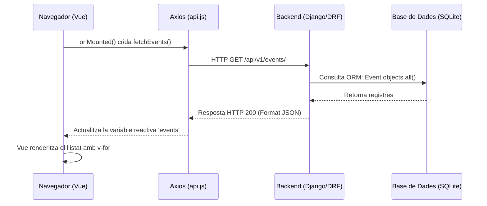

# Sessió 2: Del Backend al Frontend – Consumint l'API amb Vue 3

En aquesta segona sessió, farem que el nostre frontend cobri vida. Connectarem l'aplicació Vue amb l'API de Django que vam construir a la sessió anterior.

**Objectius de la sessió:**
1. Entendre la diferència entre navegar per una API i consumir-la programàticament.
2. Configurar un servei global amb **Axios** per centralitzar les peticions HTTP.
3. Cridar l'API de Django des de Vue i renderitzar les dades de forma reactiva utilitzant `ref` i `onMounted`.
4. Modularitzar la interfície mitjançant la composició de components i el pas de dades (`props`).

**Guies relacionades:**
Abans o durant la realització d'aquesta sessió, és **imprescindible** que doneu un cop d'ull a aquestes guies de suport:
* 📖 [Introducció a Vue 3 i Composition API](../guies/introduccio_vue.md): Conceptes bàsics del framework, reactivitat i directives (`v-for`, `v-if`).
* 📖 [Seguretat: CORS i CSRF](../guies/seguretat_cors_csrf.md): Per entendre com interactuen el frontend i el backend de forma segura i evitar els bloquejos del navegador.

---

## 1. L'API: Django REST Framework vs. Codi Client

Fins ara, hem accedit a l'API a través del navegador web (ex: `http://localhost:8000/api/v1/events/`), veient la interfície amigable que ens proporciona Django REST Framework (DRF).

No obstant això, quan una aplicació web client (el nostre Vue) fa una petició, no rep botons ni colors, rep **dades pures en format JSON**. 

**Prova-ho tu mateix:** Obre la teva terminal i fes una petició directa sense navegador usant `curl`:
```bash
curl http://localhost:8000/api/v1/events/
```
Veuràs que el resultat és un simple text estructurat. Aquest JSON és l'idioma universal amb el qual parlarem avui mitjançant una llibreria anomenada **Axios**.

---

## 2. El Servei de l'API i el Llistat d'Esdeveniments

Anem a crear la infraestructura perquè Vue demani aquest JSON i el pinti per pantalla. 

### Diagrama de la comunicació
Aquest és el flux exacte del que passarà quan carreguem la nostra pàgina de llistat:



### 2.1. Configurar Axios
Crea el fitxer `src/services/api.js`. Aquest fitxer serà el nostre "telèfon" directe cap al backend, evitant haver d'escriure la URL completa a cada lloc.

```javascript
import axios from 'axios';

const api = axios.create({
    baseURL: 'http://localhost:8000/api/v1/', // URL base de la nostra API de Django
    timeout: 5000,
    headers: {
        'Content-Type': 'application/json',
    }
});

export default api;
```

### 2.2. El component `EventList.vue`
Crea un nou component a `src/components/EventList.vue`. Aquí utilitzarem `onMounted` per fer la crida just quan el component es munti a la pantalla, i `ref` per guardar el resultat reactivament.

```vue
<script setup>
import { ref, onMounted } from 'vue';
import api from '../services/api';

const events = ref([]);

onMounted(async () => {
    try {
        const response = await api.get('events/');
        events.value = response.data; // Guardem el JSON a la variable reactiva
    } catch (error) {
        console.error("Error carregant esdeveniments:", error);
    }
});
</script>

<template>
  <div class="event-container">
    <h2>Pròxims Esdeveniments</h2>
    <div class="events-grid">
      <div v-for="event in events" :key="event.id" class="event-card">
        <h3>{{ event.name }}</h3>
        <p>Data: {{ event.date }}</p>
      </div>
    </div>
  </div>
</template>

<style scoped>
.events-grid { display: flex; gap: 1rem; flex-wrap: wrap; }
.event-card { border: 1px solid #ccc; padding: 1rem; border-radius: 8px; min-width: 200px; }
</style>
```

### 2.3. Connectar-ho tot a `App.vue`

Ara que tenim el nostre component `EventList` llest per demanar dades, l'hem de fer visible a la pantalla principal. Per defecte, Vite ha creat un fitxer `src/App.vue` ple de codi i logos d'exemple. L'anem a netejar completament.

Obre `src/App.vue` i substitueix **tot** el seu contingut per aquest:

```vue
<script setup>
// 1. Importem el component que acabem de crear
import EventList from './components/EventList.vue';
</script>

<template>
  <header>
    <h1>🎟️ TicketFlow</h1>
  </header>

  <main>
    <EventList />
  </main>
</template>

<style scoped>
header {
  background-color: #f8f9fa;
  padding: 1rem;
  text-align: center;
  margin-bottom: 2rem;
  border-bottom: 1px solid #ddd;
}
main {
  max-width: 800px;
  margin: 0 auto;
  padding: 0 1rem;
}
</style>
````

### 2.4. La Prova de Foc: Executar i Depurar

Per veure la màgia en acció, és vital que recordeu que ara tenim **dos projectes independents**. Necessiteu obrir dues terminals diferents al vostre editor:

1.  **Terminal 1 (Backend):** \`\`\`bash
    cd backend
    uv run python manage.py runserver
    ```
    ```
2.  **Terminal 2 (Frontend):** \`\`\`bash
    cd frontend
    npm run dev
    ```
    
    ```

Obriu el navegador a l'adreça del frontend (normalment `http://localhost:5173`). Si veieu la llista dels vostres esdeveniments... 🎉 Felicitats\! Heu connectat amb èxit el Vue amb el Django.

#### 🚨 No es veu res? (El clàssic error de CORS)

Si la pàgina carrega però només veieu el títol de "TicketFlow" i cap dada, no us espanteu. És l'error més comú en el desenvolupament web modern.

1.  Al navegador, premeu **F12** (o feu clic dret \> Inspeccionar).
2.  Aneu a la pestanya **Consola (Console)**.
3.  Si veieu un error de color vermell que conté el text `blocked by CORS policy`, significa que el vostre backend Django està refusant parlar amb el frontend per motius de seguretat.

**Com solucionar-ho:**
Repasseu detingudament la guia de [Seguretat: CORS i CSRF](https://www.google.com/search?q=../guies/seguretat_cors_csrf.md). Us heu d'assegurar que:

  * Heu instal·lat `django-cors-headers`.
  * L'heu afegit a `INSTALLED_APPS` i als `MIDDLEWARE` del fitxer `settings.py`.
  * Heu afegit `http://localhost:5173` a la llista `CORS_ALLOWED_ORIGINS`.

---

## 3. Composició de Components (Delegació)

El component `EventList` actual està fent massa coses: demana les dades a l'API i, a més, decideix com es pinta cada targeta individual. En aplicacions grans, dividim això en components més petits per millorar el manteniment.

### 3.1. Crear el component `EventItem.vue`
Aquest component **no farà peticions**. Només rebrà un objecte `event` des del seu pare i s'encarregarà de dibuixar-lo de forma bonica. Això es fa mitjançant les **props**.

Crea el fitxer `src/components/EventItem.vue`:

```vue
<script setup>
// Definim que aquest component espera rebre una propietat anomenada 'event'
defineProps({
    event: {
        type: Object,
        required: true
    }
});
</script>

<template>
  <div class="event-card">
    <h3>{{ event.name }}</h3>
    <p><strong>Data:</strong> {{ event.date }}</p>
    <p><strong>Preu:</strong> {{ event.price }} €</p>
    <button>Veure detalls</button>
  </div>
</template>

<style scoped>
.event-card { border: 1px solid #ccc; padding: 1rem; border-radius: 8px; }
</style>
```

### 3.2. Refactoritzar `EventList.vue`
Ara, modifica el fitxer `EventList.vue`. Importa el nou component i fes que delegui la tasca de pintat cridant a `EventItem` i passant-li les dades:

```vue
<script setup>
import { ref, onMounted } from 'vue';
import api from '../services/api';
import EventItem from './EventItem.vue'; // <-- Importem el component fill

const events = ref([]);

// ... (El onMounted es queda igual) ...
</script>

<template>
  <div class="event-container">
    <h2>Pròxims Esdeveniments</h2>
    <div class="events-grid">
      <EventItem 
        v-for="event in events" 
        :key="event.id" 
        :event="event" 
      />
    </div>
  </div>
</template>
```

Aquest patró de disseny us serà extremadament útil a mesura que l'aplicació vagi creixent.

---

## 🏠 Treball fora del laboratori: Tests de l'API

A la Sessió 1 vau crear els models `Event`, `Ticket` i `User`. Ara que ja hem configurat l'entorn de proves del backend amb `pytest`, l'objectiu és assegurar-nos que la nostra API és robusta abans de continuar construint complexitat al frontend.

**Tasques a realitzar:**
Aneu a la carpeta `backend/api/tests/` i creeu els fitxers de test necessaris (ex: `test_events.py` o `test_tickets.py`). Heu d'implementar proves per verificar el comportament dels vostres endpoints utilitzant l'`APIClient` de DRF.

**Exemples de validacions que heu de programar:**
1. **Llistat d'elements (GET):** Comprovar que si faig un GET a `/api/v1/events/` em retorna un codi d'estat 200 (OK) i una llista.
2. **Creació d'elements (POST):** Comprovar que puc crear un esdeveniment enviant un JSON vàlid i que el sistema retorna un 201 (Created).
3. **Validació d'errors (Bad Request):** Comprovar que si intento crear un esdeveniment *sense* camps obligatoris (com el nom o el preu), l'API no peta, sinó que em retorna un error 400.

*Exemple d'estructura per començar un test de DRF:*
```python
import pytest
from rest_framework.test import APIClient
from api.models import Event

@pytest.mark.django_db
class TestEventAPI:
    def setup_method(self):
        self.client = APIClient()

    def test_get_events_list(self):
        # 1. Preparació (Crear dades de prova a la BD temporal)
        Event.objects.create(name="Concert Rock", date="2026-05-20", price=25.50)
        
        # 2. Acció (Fer la petició HTTP local)
        response = self.client.get('/api/v1/events/')
        
        # 3. Comprovació (Asserts)
        assert response.status_code == 200
        assert len(response.data) == 1
        assert response.data[0]['name'] == "Concert Rock"
```
