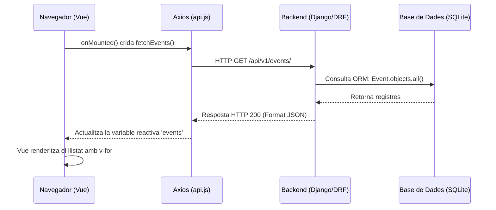

# Sessió 2: Del Backend al Frontend – Consumint l'API amb Vue 3

En aquesta segona sessió, farem que el nostre frontend cobri vida. Connectarem l'aplicació Vue amb l'API de Django que vam construir a la sessió anterior.

**Objectius de la sessió:**
1. Entendre la diferència entre navegar per una API i consumir-la programàticament.
2. Configurar un servei global amb **Axios** per centralitzar les peticions HTTP.
3. Cridar l'API de Django des de Vue i renderitzar les dades de forma reactiva utilitzant `ref` i `onMounted`.
4. Modularitzar la interfície mitjançant la composició de components i el pas de dades (`props`).

**Guies relacionades:**
Abans o durant la realització d'aquesta sessió, és **imprescindible** que doneu un cop d'ull a aquestes guies de suport:
* 📖 [Introducció a Vue 3 i Composition API](../guies/introduccio_vue.md): Conceptes bàsics del framework, reactivitat i directives (`v-for`, `v-if`).
* 📖 [Seguretat: CORS i CSRF](../guies/seguretat_cors_csrf.md): Per entendre com interactuen el frontend i el backend de forma segura i evitar els bloquejos del navegador.
* 📖 [Validació de dades](../guies/serialitzadors_validacio_dades.md): Per entendre com podem validar les dades d'entrada en els serialitzadors.
* 📖 [Serialitzadors aniuats](../guies/serialitzadors_niuats.md): Per entendre com podem aniuar serialitzadors.
* 📖 [Gestió d'errors i operacions atòmiques](../guies/drf_gestio_errors.md): Per veure com gestionar els errors en DRF i com realitzar operacions atòmiques.

---

## 1. L'API: Django REST Framework vs. Codi Client

Fins ara, hem accedit a l'API a través del navegador web (ex: `http://localhost:8000/api/v1/events/`), veient la interfície amigable que ens proporciona Django REST Framework (DRF).

No obstant això, quan una aplicació web client (el nostre Vue) fa una petició, no rep botons ni colors, rep **dades pures en format JSON**. 

**Prova-ho tu mateix:** Obre la teva terminal i fes una petició directa sense navegador usant `curl`:
```bash
curl http://localhost:8000/api/v1/events/
```

Veuràs que el resultat és un simple text estructurat. Aquest JSON és l'idioma universal amb el qual parlarem avui mitjançant una llibreria anomenada **Axios**.

---

## 2. El Servei de l'API i el Llistat d'Esdeveniments

Anem a crear la infraestructura perquè Vue demani aquest JSON i el mostri per pantalla. 

### Diagrama de la comunicació

Aquest és el flux exacte del que passarà quan carreguem la nostra pàgina de llistat:



### 2.1. Configurar Axios

Crea el fitxer `src/services/api.js`. Aquest fitxer serà el nostre "telèfon" directe cap al backend, evitant haver d'escriure la URL completa a cada lloc.

```javascript
import axios from 'axios';

const api = axios.create({
    baseURL: 'http://localhost:8000/api/v1/', // URL base de la nostra API de Django
    timeout: 5000,
    headers: {
        'Content-Type': 'application/json',
    }
});

export default api;
```

### 2.2. El component `EventList.vue`

Crea un nou component a `src/components/EventList.vue`. Aquí utilitzarem `onMounted` per fer la crida just quan el component es munti a la pantalla, i `ref` per guardar el resultat reactivament. Fixa't que estem utilitzant els camps que es van definir a la sessió 1 com a part del model (`titol`, `data`, ...).

```vue
<script setup>
import { ref, onMounted } from 'vue';
import api from '../services/api';

const events = ref([]);

onMounted(async () => {
    try {
        const response = await api.get('events/');
        events.value = response.data; // Guardem el JSON a la variable reactiva
    } catch (error) {
        console.error("Error carregant esdeveniments:", error);
    }
});
</script>

<template>
  <div class="event-container">
    <h2>Pròxims Esdeveniments</h2>
    <div class="events-grid">
      <div v-for="event in events" :key="event.id" class="event-card">
        <h3>{{ event.titol }}</h3>
        <p>Data: {{ event.data }}</p>
      </div>
    </div>
  </div>
</template>

<style scoped>
.events-grid { display: flex; gap: 1rem; flex-wrap: wrap; }
.event-card { border: 1px solid #ccc; padding: 1rem; border-radius: 8px; min-width: 200px; }
</style>
```

### 2.3. Connectar-ho tot a `App.vue`

Per defecte, **Vite** ha creat un fitxer `src/App.vue` ple de codi i logos d'exemple. L'anem a netejar completament.

Obre `src/App.vue` i substitueix **tot** el seu contingut per aquest:

```vue
<script setup>
// 1. Importem el component que acabem de crear
import EventList from './components/EventList.vue';
</script>

<template>
  <header>
    <h1>🎟️ TicketFlow</h1>
  </header>

  <main>
    <EventList />
  </main>
</template>

<style scoped>
header {
  background-color: #f8f9fa;
  padding: 1rem;
  text-align: center;
  margin-bottom: 2rem;
  border-bottom: 1px solid #ddd;
}
main {
  max-width: 800px;
  margin: 0 auto;
  padding: 0 1rem;
}
</style>
```

### 2.4. La Prova de Foc: Executar i Depurar

Per veure la màgia en acció, és vital que recordeu que ara tenim **dos projectes independents**. Necessiteu obrir dues terminals diferents al vostre editor per executar el `backend` i el `frontend` **simultàniament**:

1. **Terminal 1 (Backend):**

```bash
    cd backend
    uv run python manage.py runserver
```

2. **Terminal 2 (Frontend):** 

```bash
    cd frontend
    npm run dev
```

Obriu el navegador a l'adreça del frontend (normalment `http://localhost:5173`). Si veieu la llista dels vostres esdeveniments... 🎉 Felicitats\! Heu connectat amb èxit el Vue amb el Django.

#### 🚨 No es veu res? (El clàssic error de CORS)

Si la pàgina carrega però només veieu el títol de "TicketFlow" i cap dada, no us espanteu. És l'error més comú en el desenvolupament web modern.

1.  Al navegador, premeu **F12** (o feu clic dret \> Inspeccionar).
2.  Aneu a la pestanya **Consola (Console)**.
3.  Si veieu un error de color vermell que conté el text `blocked by CORS policy`, significa que el vostre backend Django està refusant parlar amb el frontend per motius de seguretat.

**Com solucionar-ho:**
Repasseu detingudament la guia de [Seguretat: CORS i CSRF](../guies/seguretat_cors_csrf.md). Us heu d'assegurar que:

  * Heu instal·lat `django-cors-headers`.
  * L'heu afegit a `INSTALLED_APPS` i als `MIDDLEWARE` del fitxer `settings.py`.
  * Heu afegit `http://localhost:5173` a la llista `CORS_ALLOWED_ORIGINS`.

---

## 3. Composició de Components (Delegació)

El component `EventList` actual està fent massa coses: demana les dades a l'API i, a més, decideix com es pinta cada targeta individual. En aplicacions grans, dividim això en components més petits per millorar el manteniment. Crearem un fill anomenat `EventItem` que només s'encarregarà de dibuixar l'esdeveniment rebent les dades via **props**.

### 3.1. Crear el component `EventItem.vue`

Crea el fitxer `src/components/EventItem.vue`:

```vue
<script setup>
// Definim que aquest component espera rebre una propietat anomenada 'event'
defineProps({
    event: {
        type: Object,
        required: true
    }
});
</script>

<template>
  <div class="event-card">
    

    <h3>{{ event.titol }}</h3>
    <p><strong>Data:</strong> {{ event.data }}</p>
    <p><strong>Preu:</strong> {{ event.preu }} €</p>
    <p><strong>Places restants:</strong> {{ event.capacitat }}</p>
    <button>Afegir a la cistella</button>
  </div>
</template>

<style scoped>
.event-card { border: 1px solid #ccc; padding: 1rem; border-radius: 8px; }
.event-img { width: 100%; border-radius: 4px; margin-bottom: 10px; }
</style>
```

### 3.2. Refactoritzar `EventList.vue`

Modifica `EventList.vue` perquè delegui la tasca de mostrar un event concret a `EventItem`:

```vue
<script setup>
import { ref, onMounted } from 'vue';
import api from '../services/api';
import EventItem from './EventItem.vue'; // <-- Importem el component fill

const events = ref([]);

// ... (El onMounted es queda igual) ...
</script>

<template>
  <div class="event-container">
    <h2>Pròxims Esdeveniments</h2>
    <div class="events-grid">
      <EventItem 
        v-for="event in events" 
        :key="event.id" 
        :event="event" 
      />
    </div>
  </div>
</template>
```

Aquest patró de disseny us serà extremadament útil a mesura que l'aplicació vagi creixent.

---

## 🏠 Treball fora del laboratori: L'API com a Capa de Negoci (El Checkout)

Fins ara hem dissenyat la nostra API com un mirall estricte de la nostra base de dades: tenim un endpoint per a `Events`, un per a `Compres` i un per a `Entrades`. Aquesta arquitectura tipus CRUD (Crear, Llegir, Actualitzar, Esborrar) està molt bé per a la gestió de dades bàsica.

Però, què passa amb la cistella de la compra? Processar una comanda no és només "inserir un registre", és un **procés de negoci** que implica:
1. Rebre una llista d'esdeveniments i quantitats.
2. Validar si hi ha prou aforament per a tots.
3. Crear una nova `Compra`.
4. Crear les `Entrades` corresponents.
5. Si qualsevol pas falla, **desfer-ho absolutament tot** perquè l'usuari no es quedi amb una compra a mitges.

Per resoldre això, abandonarem els `ModelViewSets` automàtics i crearem un endpoint dedicat exclusivament a aquest procés: el **Checkout**.

**Tasques a realitzar:**

1. **El Serialitzador de Negoci (`serializers.py`):**
   Crea un serialitzador que no hereti de `ModelSerializer`, sinó directament de `serializers.Serializer`. Aquest serialitzador no es guardarà a cap taula de cop, només servirà per validar el JSON que ens enviarà el Vue. Ha d'acceptar una llista d'objectes amb l'`id` de l'esdeveniment i la `quantitat`.
   *(Pista: Investiga com fer servir `serializers.ListField` o crear un serialitzador niuat bàsic per a les línies de la comanda).*

2. **La Vista de Checkout i l'Atomicitat (`views.py`):**
   Crea una nova vista anomenada `CheckoutView` que hereti de `APIView` (la vista més bàsica de DRF). 
   * Implementa el mètode `post(self, request)`.
   * Utilitza el decorador `@transaction.atomic` per garantir la regla del "Tot o Res".
   * Dins del mètode, extreu les dades, valida l'aforament de cada esdeveniment consultant la base de dades, crea la `Compra`, i genera les `Entrades`. Si un esdeveniment no té aforament, llança un error (ex: `Response({"error": "..."}, status=400)`). L'excepció farà que la transacció atòmica desfaci els canvis previs automàticament.

3. **Registrar l'Endpoint (`urls.py`):**
   Afegeix la teva nova vista al fitxer de rutes manualment perquè respongui a l'adreça `/api/v1/checkout/`.

4. **Tests de la Lògica de Negoci (`tests.py`):**
   Crea un nou test `test_checkout_fa_rollback_si_no_hi_ha_aforament`. Simula una petició `POST` a `/api/v1/checkout/` enviant un JSON amb dos esdeveniments, on un d'ells superi la capacitat màxima. 
   Verifica mitjançant `asserts` que l'API retorna un `400 BAD REQUEST` i que el nombre de compres (`Compra.objects.count()`) i entrades a la base de dades segueix sent `0` (l'error d'un ha cancel·lat la creació de l'altre).

5. **Pull Request:** Fes `commit`, `push` a la branca `dev` i obre una PR cap a `main` perquè les GitHub Actions validin la teva nova lògica de negoci.

