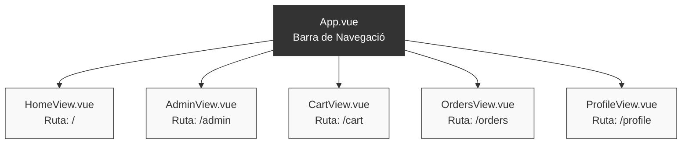

# Sessió 3: Navegació (Vue Router) i Estat Global (Cistella amb Pinia)

A la sessió anterior ja vam introduir Vue Router per a la navegació bàsica. En aquesta sessió convertirem el nostre projecte en una aplicació web completa afegint-hi noves "pàgines" (Vistes), integrarem una llibreria d'icones professionals, i construirem una cistella de la compra persistent utilitzant **Pinia** i el `LocalStorage` del navegador.

**Objectius de la sessió:**

1.  Integrar Google Material Symbols per millorar la interfície d'usuari.
2.  Ampliar l'enrutador (`vue-router`) per suportar noves seccions (Admin, Cistella, Compres).
3.  Entendre la composició de components creant un `ModifiableEventItem` per a la vista d'administració.
4.  Configurar **Pinia** per gestionar l'estat global de l'aplicació.
5.  Crear la funcionalitat d'afegir, modificar i esborrar elements de la cistella, connectant-ho amb la barra de navegació.

**Guies relacionades:**
Abans o durant la realització d'aquesta sessió, us recomanem consultar:
* 📖 **[Emmagatzematge Local i Pinia](../guies/localstorage_pinia.md):** Guia essencial per entendre com funciona l'estat global compartit entre múltiples components.
* 📖 **[Documentació de Vue Router](https://router.vuejs.org/):** Per aprofundir en rutes dinàmiques i protecció de rutes.

-----

## 1\. Noves Vistes i Barra de Navegació

### 1.1. Integrar Google Material Symbols

Per utilitzar icones de forma senzilla i professional, afegirem la font oficial de Google Material Symbols. Obre el fitxer **`index.html`** (a l'arrel del projecte, fora de la carpeta `src`) i afegeix aquesta línia dins de l'etiqueta `<head>`:

```html
<link rel="stylesheet" href="https://fonts.googleapis.com/css2?family=Material+Symbols+Outlined:opsz,wght,FILL,GRAD@24,400,0,0" />
```

A partir d'ara, si voleu inserir una icona a qualsevol lloc de la vostra aplicació, només heu d'afegir una etiqueta `<span>` amb la classe `material-symbols-outlined` i escriure el nom de la icona a l'interior, d'aquesta manera:

```html
<span class="material-symbols-outlined">home</span>
```

Podeu trobar el catàleg complet d'icones i cercar les que necessiteu a la URL oficial: **[Google Material Symbols](https://fonts.google.com/icons?icon.set=Material+Symbols)**. 

En concret, per a aquesta sessió fixeu-vos en les icones relacionades amb la cistella, com ara `shopping_cart` (ideal per a la barra de navegació), `add_shopping_cart` (per al botó d'afegir un esdeveniment), o `delete` (per eliminar elements o buidar la cistella).


### 1.2. Preparar les noves Vistes (Views) i el Mapa de Navegació

Abans de començar a configurar rutes i picar codi, tinguem clar l'objectiu visual. En aquesta sessió volem construir una barra de navegació superior permanent que ens permeti moure'ns per les diferents seccions de l'aplicació, incloent-hi un indicador reactiu per a la cistella i un accés al perfil d'usuari (que utilitzarem a fons a la Sessió 4). 

El resultat final de la nostra interfície hauria de ser similar a aquest:

```text
+-----------------------------------------------------------------------------+
|  🎟️ TicketFlow      [Inici]  [Administració]  [Compres]     🛒 (2)  👤 Perfil |
+-----------------------------------------------------------------------------+
|                                                                             |
|  Pròxims Esdeveniments                                                      |
|  ---------------------                                                      |
|                                                                             |
|  +------------------------+  +------------------------+                     |
|  | 🎸 Concert de Rock     |  | 🎭 Obra de Teatre      |                     |
|  | 12/05/2026             |  | 15/05/2026             |                     |
|  | Preu: 25 €             |  | Preu: 15 €             |                     |
|  |                        |  |                        |                     |
|  | [ 🛒 Afegir Cistella ] |  | [ 🛒 Afegir Cistella ] |                     |
|  +------------------------+  +------------------------+                     |
|                                                                             |
+-----------------------------------------------------------------------------+
```

Per aconseguir això, l'estructura lògica de navegació (l'enrutament) de la nostra aplicació quedarà organitzada d'aquesta manera:



**Què heu de fer ara?**
Dins la carpeta `src/views/`, assegureu-vos de tenir creats els següents fitxers. De moment poden estar buits, només amb un simple `<h1>` (ex: `<h1>Secció Admin</h1>`) per poder comprovar que la navegació funciona correctament als passos següents:

* `HomeView.vue` (L'arrel del projecte, on mourem el llistat d'esdeveniments principal de la Sessió 2).
* `AdminView.vue` (Per gestionar esdeveniments, afegir-ne de nous, editar-los...).
* `CartView.vue` (On veurem el resum de la cistella abans de pagar).
* `OrdersView.vue` (L'historial de compres de l'usuari).
* `ProfileView.vue` (El perfil de l'usuari, que prepararem per a la següent sessió).


**Com omplim aquestes vistes? L'exemple de `HomeView.vue`**

Per entendre com funciona aquesta nova estructura, agafarem la lògica de la llista d'esdeveniments de la Sessió 2 i la mourem al seu lloc definitiu: la vista principal.

Obriu el fitxer `src/views/HomeView.vue` i afegiu-hi el següent codi. Fixeu-vos que aquí és on fem la petició GET a la nostra API i on importem el component `EventItem` per dibuixar cada targeta:

```vue
<script setup>
  import EventsList from '../components/EventsList.vue';
</script>

<template>
  <div class="home">
    <h2>Pròxims Esdeveniments</h2>
    
    <EventsList />
  </div>
</template>

<style scoped>
  .home {
    padding: 1rem;
  }
</style>
```

D'aquesta manera, cada vegada que l'usuari navegui a la ruta `/` (Inici), Vue Router carregarà aquest component, el qual farà la petició a l'API i mostrarà la graella de forma completament automàtica. La resta de vistes (Admin, Cart, etc.) seguiran el mateix patró d'encapsulació.

### 1.3. Ampliar l'Enrutador (`src/router/index.js`)
Ara que ja sabem quines vistes necessitem, modificarem el fitxer d'enrutament per connectar les URLs amb els components corresponents, incloent-hi la nova vista de Perfil.

```javascript
import { createRouter, createWebHistory } from 'vue-router'
import HomeView from '../views/HomeView.vue'
import AdminView from '../views/AdminView.vue'
import CartView from '../views/CartView.vue'
import OrdersView from '../views/OrdersView.vue'
import ProfileView from '../views/ProfileView.vue' 

const router = createRouter({
  history: createWebHistory(import.meta.env.BASE_URL),
  routes: [
    { path: '/', name: 'home', component: HomeView },
    { path: '/admin', name: 'admin', component: AdminView },
    { path: '/cart', name: 'cart', component: CartView },
    { path: '/orders', name: 'orders', component: OrdersView },
    { path: '/profile', name: 'profile', component: ProfileView } 
  ]
})

export default router
```

### 1.4. La Barra de Navegació a `App.vue`

Ara substituirem el contingut de l'`App.vue` per afegir-hi el menú de navegació. Fixeu-vos que hem d'importar el component `RouterLink` a la part superior per poder crear els enllaços cap a les noves vistes.

```vue
<script setup>
  import { RouterView, RouterLink } from 'vue-router'
</script>

<template>
  <div class="app-container">
    <header>
      <h1>🎟️ TicketFlowUB</h1>
      
      <nav class="navbar">
        <div class="links">
          <RouterLink to="/" class="nav-link">Inici</RouterLink>
          <RouterLink to="/admin" class="nav-link">Administració</RouterLink>
          <RouterLink to="/orders" class="nav-link">Compres</RouterLink>
          
          <RouterLink to="/cart" class="nav-link">
            <span class="material-symbols-outlined">shopping_cart</span>
            Cistella
          </RouterLink>

          <RouterLink to="/profile" class="nav-link">
            <span class="material-symbols-outlined">account_circle</span>
            Perfil
          </RouterLink>
        </div>
      </nav>
    </header>

    <main>
      <RouterView />
    </main>
  </div>
</template>

<style scoped>
  .app-container {
    font-family: sans-serif;
    max-width: 1200px;
    margin: 0 auto;
    padding: 20px;
  }
  header {
    text-align: center;
    border-bottom: 2px solid #42b883;
    padding-bottom: 20px;
    margin-bottom: 20px;
  }
  h1 {
    color: #42b883;
    margin-bottom: 15px; /* Afegim una mica d'espai amb el menú */
  }
  
  /* Estils de la barra de navegació */
  .navbar { 
    display: flex; 
    justify-content: center; 
    background: #f8f9fa; 
    padding: 10px; 
    border-radius: 8px;
  }
  .links { 
    display: flex; 
    align-items: center; 
    gap: 0.5rem; /* Espai entre botons */
    flex-wrap: wrap; /* Per si la pantalla és petita, que baixin a la línia inferior */
    justify-content: center;
  }
  
  /* Estil comú per a TOTS els enllaços */
  .nav-link { 
    color: #333; 
    text-decoration: none; 
    display: flex; 
    align-items: center; 
    gap: 0.4rem; 
    padding: 0.5rem 1rem;
    border-radius: 20px; /* Forma de píndola per a tots */
    transition: background-color 0.2s, color 0.2s;
  }
  
  /* Efecte en passar el ratolí per sobre */
  .nav-link:hover {
    background-color: #e9ecef;
  }

  /* Estil quan estem a la pàgina activa (es posarà verd) */
  .nav-link.router-link-active { 
    font-weight: bold; 
    color: white;
    background-color: #42b883;
  }
</style>
```

---

## 2. Composició per a l'Admin: `ModifiableEventItem`

A la vista d'Administració (`AdminView.vue`) volem mostrar els esdeveniments amb botons per Editar i Eliminar. Farem servir la **composició** creant un component que importi el vostre `EventItem.vue` normal i li afegeixi els controls a sota.

Creeu `src/components/ModifiableEventItem.vue`:

```vue
<script setup>
import EventItem from './EventItem.vue';

const props = defineProps({
    event: { type: Object, required: true }
});

const handleDelete = async () => {
    if (confirm(`Segur que vols eliminar ${props.event.titol}?`)) {
        console.log(`Cridant al servei per eliminar l'esdeveniment amb ID: ${props.event.id}`);
        // TODO: Treball fora del laboratori
    }
};

const handleEdit = () => {
    console.log(`Obrint formulari d'edició per l'esdeveniment amb ID: ${props.event.id}`);
    // TODO: Treball fora del laboratori
};
</script>

<template>
  <div class="admin-card">
    <EventItem :event="event" />
    
    <div class="admin-actions">
      <button @click="handleEdit" class="btn-edit">
        <span class="material-symbols-outlined">edit</span> Editar
      </button>
      <button @click="handleDelete" class="btn-delete">
        <span class="material-symbols-outlined">delete</span> Eliminar
      </button>
    </div>
  </div>
</template>

<style scoped>
.admin-card { border: 2px dashed #f39c12; margin-bottom: 1rem; border-radius: 8px; overflow: hidden; }
.admin-actions { display: flex; justify-content: space-around; padding: 0.8rem; background: #fff8e1; }
button { display: flex; align-items: center; gap: 0.3rem; cursor: pointer; padding: 0.5rem 1rem; }
</style>
```

Crea una nova vista `AdminView.vue`, on haureu de fer una petició a l'API per obtenir els esdeveniments i renderitzar-los utilitzant aquest nou `<ModifiableEventItem>` en lloc de la llista normal. Us podeu inspirar en la vista inicial i el component `EventList`.

**Nota:** En aquests moments estem delegant a `EventItem`, per tant tindrem el botó d'afegir a la cistella. De moment no és un problema, però podeu afegir opcions a `EventItem` per configurar com s'ha de visualitzar. De la mateixa forma, podeu utilitzar propietats en el `EventList` per mostrar els botons d'edició i no requerir un component addicional. Aquest codi és un exemple per il·lustrar l'ús d'un component dins d'un altre i facilitar la sessió.

---

## 3. L'Estat Global: La Cistella amb Pinia

A la Sessió 2, el nostre botó "Comprar" enviava directament les dades a l'API. Ara volem que el botó afegeixi l'esdeveniment a una cistella global (gestionada amb **Pinia**) i que aquesta persisteixi al navegador (**LocalStorage**).

### 3.1. Instal·lació i Configuració de Pinia

Fins ara, les dades de la nostra aplicació només vivien dins de cada component (estat local). Com que la cistella ha d'estar disponible a qualsevol lloc (a la llista d'esdeveniments per afegir-hi coses, i a la barra de navegació per veure'n el total), necessitem un gestor d'estat global. La solució oficial de Vue per a això és **Pinia**.

**Pas 1: Instal·lar el paquet**
Obriu un terminal a l'arrel del vostre `frontend` (on teniu el fitxer `package.json`) i atureu el servidor de desenvolupament si el teniu encès. Executeu la següent comanda:

```bash
npm install pinia
```

**Pas 2: Registrar Pinia a l'aplicació (`src/main.js`)**
Ara hem de dir-li a la nostra aplicació Vue que volem utilitzar aquesta nova eina. Obriu el fitxer principal `frontend/src/main.js` i afegiu-hi la instància de Pinia. El fitxer us hauria de quedar molt similar a aquest:

```javascript
import { createApp } from 'vue'
import { createPinia } from 'pinia' // 1. Importem Pinia
import App from './App.vue'
import router from './router'

const app = createApp(App)
const pinia = createPinia() // 2. Creem la instància de Pinia

app.use(router)
app.use(pinia) // 3. Connectem Pinia a la nostra app
app.mount('#app')
```

**Pas 3: Crear el Store de la Cistella (`src/stores/cart.js`)**
Un "Store" (magatzem) és el fitxer on guardarem les dades compartides i les funcions per modificar-les. Creeu una carpeta anomenada `stores` dins de `src` i, a dins, creeu el fitxer `cart.js`.

Utilitzarem la Composition API per definir-lo, i afegirem un petit truc amb `watch` i `localStorage` perquè la cistella no s'esborri si l'usuari prem F5 o tanca la pestanya:

```javascript
import { defineStore } from 'pinia';
import { ref, watch, computed } from 'vue';

export const useCartStore = defineStore('cart', () => {
  // 1. ESTAT: Llegim del LocalStorage al carregar, o iniciem la cistella buida
  const items = ref(JSON.parse(localStorage.getItem('ticketflow-cart')) || []);

  // Guardar automàticament al LocalStorage cada cop que la variable 'items' canviï
  watch(items, (newItems) => {
    localStorage.setItem('ticketflow-cart', JSON.stringify(newItems));
  }, { deep: true });

  // 2. GETTER: Per saber el total d'articles (útil per a la barra de navegació)
  const totalItems = computed(() => items.value.length);

  // 3. ACCIONS
  const addToCart = (event) => {
    const existingItem = items.value.find(item => item.id === event.id);
    if (existingItem) {
      existingItem.quantitat++;
    } else {
      items.value.push({ ...event, quantitat: 1 });
    }
  };

  const removeFromCart = (eventId) => {
    items.value = items.value.filter(item => item.id !== eventId);
  };

  const updateQuantity = (eventId, quantitat) => {
    const item = items.value.find(item => item.id === eventId);
    if (item && quantitat > 0) {
      item.quantitat = quantitat;
    } else if (quantitat === 0) {
      removeFromCart(eventId);
    }
  };

  const clearCart = () => {
    items.value = [];
  };

  return { items, totalItems, addToCart, removeFromCart, updateQuantity, clearCart };
});
```

### 3.2. Adaptar `EventItem.vue` per usar la cistella
**Molt important:** Esborreu la lògica de la petició POST de la Sessió 2 i la importació de `useAuth()`. Ara el botó només interactua amb l'estat de Pinia:

```vue
<script setup>
import { useCartStore } from '../stores/cart';

defineProps({ event: { type: Object, required: true } });
const cartStore = useCartStore(); 
</script>

<template>
  <div class="event-card">
    

    <h3>{{ event.titol }}</h3>
    <p><strong>Data:</strong> {{ event.data }}</p>
    <p><strong>Preu:</strong> {{ event.preu }} €</p>
    <p><strong>Places restants:</strong> {{ event.capacitat }}</p>

    <button
      class="btn-add"
      @click="cartStore.addToCart(event)"
    >
      <span class="material-symbols-outlined">add_shopping_cart</span> Afegir
    </button>
  </div>
</template>
```

### 3.3. Visualitzar la Cistella (`CartView.vue`)
Mostrem els elements, permetent modificar-ne les quantitats.

```vue
<script setup>
import { useCartStore } from '../stores/cart';
const cartStore = useCartStore();
</script>

<template>
  <div class="cart-container">
    <h2>La meva Cistella</h2>
    
    <div v-if="cartStore.items.length === 0" class="empty-cart">
      <span class="material-symbols-outlined" style="font-size: 3rem;">production_quantity_limits</span>
      <p>La cistella està buida.</p>
    </div>
    
    <div v-else>
      <div v-for="item in cartStore.items" :key="item.id" class="cart-item">
        <h4>{{ item.titol }}</h4>
        <p>{{ item.preu }} €</p>
        
        <div class="controls">
          <button @click="cartStore.updateQuantity(item.id, item.quantitat - 1)">-</button>
          <span> {{ item.quantitat }} </span>
          <button @click="cartStore.updateQuantity(item.id, item.quantitat + 1)">+</button>
          
          <button @click="cartStore.removeFromCart(item.id)" class="btn-delete">
            <span class="material-symbols-outlined">delete</span>
          </button>
        </div>
      </div>
      
      <button class="btn-checkout">Procedir al Pagament</button>
    </div>
  </div>
</template>

<style scoped>
.cart-container { padding: 1rem; max-width: 600px; margin: auto; }
.cart-item { display: flex; justify-content: space-between; align-items: center; border-bottom: 1px solid #ddd; padding: 1rem 0; }
.controls { display: flex; gap: 0.5rem; align-items: center; }
.btn-delete { color: red; background: none; border: none; cursor: pointer; }
.empty-cart { text-align: center; color: #666; margin-top: 2rem; }
</style>
```

### 3.4. El toc final: El comptador a la barra de navegació
Torneu al vostre **`App.vue`**. Ara que la cistella global existeix, podem fer que la barra de navegació mostri quants articles tenim seleccionats en temps real!

Modifiqueu l'enllaç de la cistella al `<template>`:

```vue
        <RouterLink to="/cart" class="icon-link">
            <span class="material-symbols-outlined">shopping_cart</span>
            Cistella
            <span v-if="cartStore.totalItems > 0" class="badge">
              {{ cartStore.totalItems }}
            </span>
          </RouterLink>
```

I no oblideu importar el store a la part superior de `App.vue`:
```vue
<script setup>
import { useCartStore } from './stores/cart';
const cartStore = useCartStore();
</script>
```

*(Podeu afegir CSS a `.badge` perquè sigui un cercle vermell, per exemple `background: red; color: white; border-radius: 50%; padding: 2px 6px; font-size: 0.8rem;`). Veuràs com la icona s'actualitza a l'instant en fer clic a qualsevol esdeveniment!*

---

## 🏠 Treball fora del laboratori

Ara que teniu la interfície completa i l'estat local funcionant, és el moment de connectar les noves accions amb l'API del backend:

1. **Implementar l'Eliminació i Edició (Admin):**
   * Aneu a `ModifiableEventItem.vue` i canvieu els `console.log()` per crides reals a l'API amb Axios (`api.delete(...)` i `api.put(...)`). Llanceu un event perquè `AdminView.vue` actualitzi la llista després d'esborrar.

2. **Connectar el Checkout de la Cistella (L'Endpoint de Transacció):**
   * A `CartView.vue`, el botó "Procedir al Pagament" ha de fer una petició `POST` a l'endpoint **`/api/v1/checkout/`** que vau crear al treball autònom de la Sessió 2. 
   * Recordeu utilitzar el servei temporal `useAuth()` per obtenir l'usuari actual i muntar el *payload* correctament amb els elements de `cartStore.items`.
   * Si la compra és exitosa (Status 201), buideu la cistella cridant a `cartStore.clearCart()` i redirigiu l'usuari a la vista `OrdersView` utilitzant `router.push('/orders')`.


### Guia per a l'Edició d'Esdeveniments: Conceptes Clau

Per implementar el flux d'edició (des que fem clic al botó d'editar fins que guardem el formulari), necessitareu combinar tres grans conceptes de Vue i Vue Router. Aquí teniu les pistes per entendre com encaixa cada peça:

#### 1. Comunicació de baix a dalt (`$emit`)

El vostre component `ModifiableEventItem` és el que té els botons d'"Editar" i "Eliminar", però **no hauria de fer cap crida a l'API ni canviar de pàgina**. La seva única feina és avisar el component pare (la llista d'esdeveniments) de què està passant.

* **Al component fill (`ModifiableEventItem`):** Utilitzeu la funció `defineEmits(['edit', 'delete'])`. Quan l'usuari cliqui el botó, utilitzeu la funció `emit` per llançar l'avís i adjuntar-hi l'ID de l'esdeveniment (ex: `emit('edit', props.event.id)`).
* **Al component pare (`AdminEventList`):** Quan crideu al fill a l'HTML, heu d'estar atents a aquests avisos utilitzant l'arrova: `@edit="funcioPerEditar"` i `@delete="funcioPerEliminar"`. La funció que definiu rebrà automàticament l'ID que ha enviat el fill.

#### 2. Navegació programàtica (`router.push`)

Quan el component pare rep l'avís d'eliminar, simplement fa una crida `DELETE` a l'API. Però quan rep l'avís d'**editar**, el que volem és canviar de pàgina per mostrar un formulari. Com ho fem des de JavaScript si no tenim un `<router-link>`?

* Necessiteu importar `useRouter` des de `vue-router`.
* Aquesta eina permet "empènyer" (push) l'usuari cap a una nova URL des de dins d'una funció.
* **La pista:** Dins la vostra `funcioPerEditar(id)`, haureu d'utilitzar una ordre com `router.push('/admin/events/' + id + '/edit')`.

#### 3. Rutes Dinàmiques i lectura de paràmetres

Si envieu l'usuari a una URL com `/admin/events/5/edit`, el Vue Router necessita saber què fer amb aquest "5". No podem crear una ruta al fitxer de configuració per a cada número possible.

* **Al `router/index.js`:** Quan definiu el `path` per al component del formulari d'edició, heu d'utilitzar els dos punts (`:`) per indicar que una part de la URL serà una variable. Per exemple: `path: '/la-teva-ruta/:id/edit'`.
* **Al component del formulari (`EventEditView`):** Quan aquest component es carregui, necessita saber quin és l'esdeveniment que ha d'editar per poder anar a l'API a demanar les dades i omplir el formulari. 
* **Com llegim aquest número?** Així com `useRouter` serveix per *moure's*, necessitareu importar `useRoute` per *llegir on som*. Tindreu accés al valor del paràmetre a través de `route.params.id`.

#### El flux recomanat que heu d'aconseguir:
1.  Clic al botó Editar → S'emet l'ID.
2.  El pare rep l'ID i fa un `router.push()` cap a la URL d'edició.
3.  Es carrega el nou component del formulari, que llegeix l'ID de la URL amb `route.params.id`.
4.  En el `onMounted`, feu un `GET` a l'API demanant les dades d'aquell ID i ompliu les variables reactives del formulari (`v-model`).
5.  En fer el `submit` del formulari, feu un `PUT` a l'API amb les noves dades i torneu a la llista.
