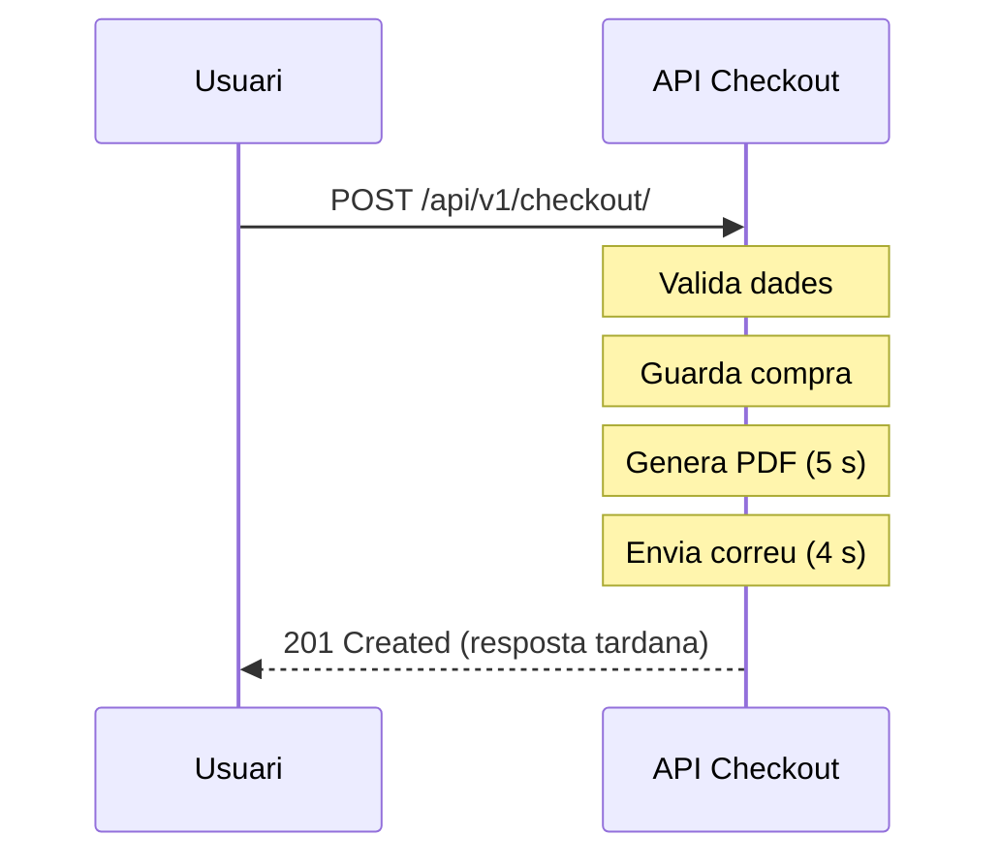
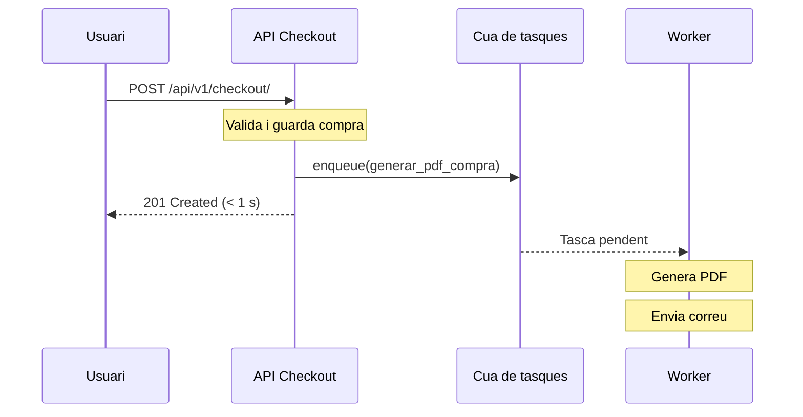
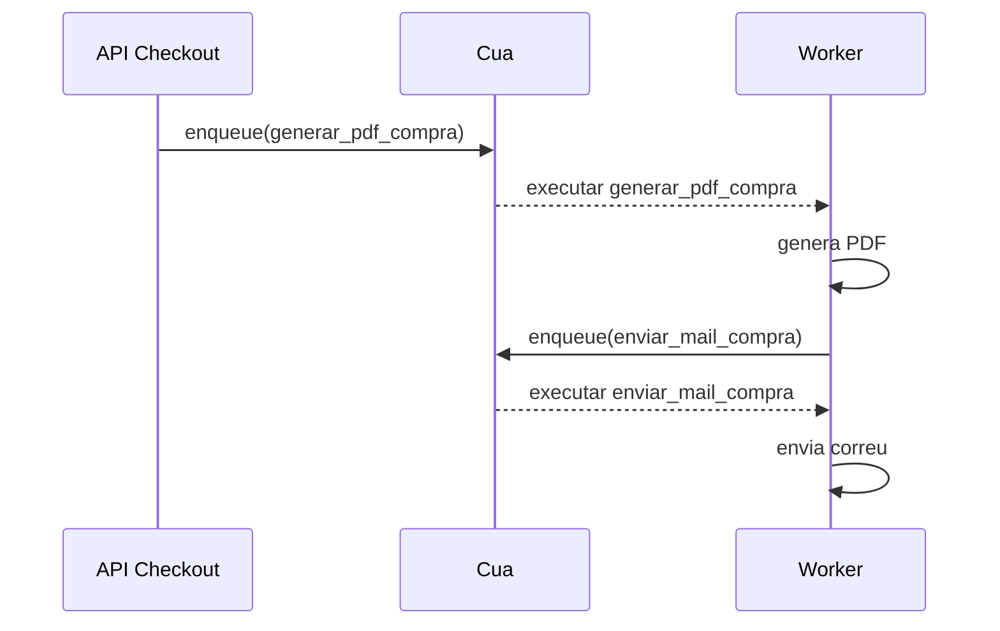
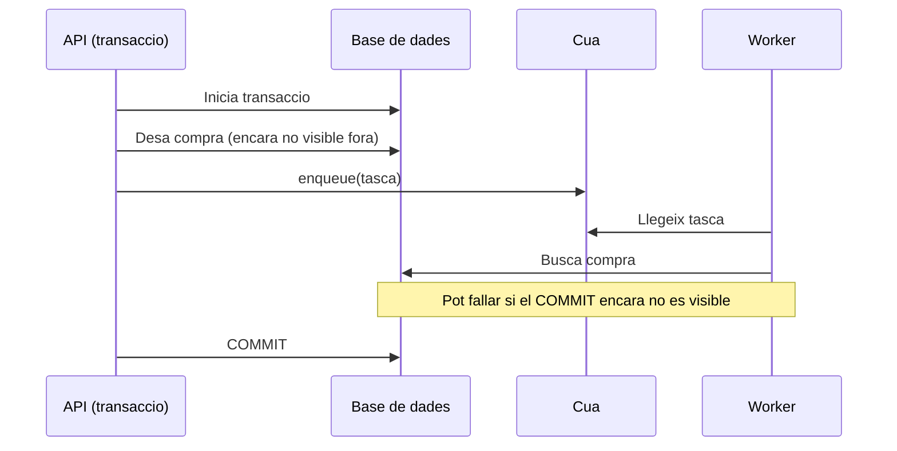

# Sessió 6: Desplegament amb Docker i Tasques Asíncrones

En aquesta sessió abordem dos temes que transformen l'aplicació d'un prototip de laboratori en un sistema llest per a producció: el desplegament amb **Docker** i l'execució de **tasques asíncrones** en segon pla.

**Objectius de la sessió:**

1. Comprendre per quin motiu certs processos no es poden executar dins d'una petició HTTP síncrona.
2. Definir i encuar tasques en segon pla amb el sistema de tasques natiu de Django 6.
3. Arrancar i verificar el *worker* de tasques en local.
4. Entendre l'arquitectura del desplegament amb Docker: rols de Traefik, Gunicorn, Nginx i les xarxes internes.
5. Orquestrar tots els serveis (backend, frontend, base de dades, worker i proxy) amb Docker Compose.

**Guies relacionades:**

* 📖 [Tasques Asíncrones i Programades a Django](../guies/tasques_asincrones.md)
* 📖 [Entorns d'Execució: Desenvolupament vs Producció (Docker)](../guies/docker_dev_vs_prod.md)
* 📖 [Docker Desktop a Windows (Aules)](../guies/docker_desktop_windows.md)
* 📖 [Cadenes de Tasques amb Celery i django_q2](../guies/cadenes_tasques_celery_django_q2.md)

---

## 1. Tasques en segon pla amb Django 6

### 1.1. El problema que volem resoldre

Imagineu que, en finalitzar una compra, el sistema ha d'enviar un correu de confirmació i generar un PDF amb les entrades. Ambdues operacions podrien trigar entre 3 i 10 segons cadascuna. Si les executem directament a la vista de `checkout`, el navegador de l'usuari quedarà bloquejat esperant:



Temps total de resposta: ~10 s. En condicions de càrrega, el servidor pot arribar a esgotar el temps màxim de resposta del proxy (normalment 30 s) i retornar `504 Gateway Timeout`.

**La solució** és retornar la resposta immediatament un cop la compra estigui guardada i delegar les tasques costoses a un procés separat (*worker*) que les executarà en segon pla.



### 1.2. Tasques natives a Django 6

 A partir de Django 6, el framework inclou el mòdul `django.tasks` de forma nativa. Tanmateix, Django **no proporciona cap worker integrat ni un backend de base de dades**; les úniques implementacions incloses (`ImmediateBackend` i `DummyBackend`) són per a desenvolupament i tests. Per a un entorn real (amb una cua persistent a la BD i un worker), cal instal·lar el paquet `django-tasks-db`.

#### Instal·lació del paquet

```bash
uv add django-tasks-db
```

#### Configuració a `settings.py`

Afegiu `django_tasks_db` a `INSTALLED_APPS` i configureu el backend:

```python
# settings.py
INSTALLED_APPS = [
    # ... apps existents ...
    "django_tasks_db",   # <-- backend de tasques amb BD
]

TASKS = {
    "default": {
        "BACKEND": "django_tasks_db.DatabaseBackend",
        "QUEUES": ["default"],
    }
}
```

#### Crear les migracions de la cua

El backend de base de dades emmagatzema les tasques pendents en una taula pròpia. Genereu i apliqueu les migracions:

```bash
uv run python manage.py migrate
```

### 1.3. Exemple pràctic: PDF + correu (dos patrons)

Per poder provar l'enviament de correu sense enviar cap email real, configurarem el backend de correu de Django en mode consola. Això fa que el contingut del missatge es mostri per terminal.

Primer, afegiu aquesta configuració a `settings.py`:

```python
# settings.py
EMAIL_BACKEND = "django.core.mail.backends.console.EmailBackend"
DEFAULT_FROM_EMAIL = "no-reply@entrades.local"
```

Ara, creeu un fitxer `tasks.py` a l'aplicació de backend. A continuació teniu dos patrons habituals.

#### Patró A: una sola tasca (PDF + correu)

```python
# api/tasks.py
import logging

from django.core.mail import send_mail
from django.tasks import task

logger = logging.getLogger(__name__)


@task
def confirmar_compra_pdf_i_mail(compra_id: int) -> None:
  """Genera el PDF i envia el correu dins la mateixa tasca."""
  logger.info("[TASK] Iniciant confirmació completa per a la compra %d", compra_id)

  # Exemple simplificat: simulació de generació de PDF
  pdf_path = f"/tmp/compra_{compra_id}.pdf"
  logger.info("[TASK] PDF generat a %s", pdf_path)

  send_mail(
    subject=f"Confirmació de compra #{compra_id}",
    message=(
      "Hem rebut la teva compra correctament.\n"
      f"ID de compra: {compra_id}\n"
      f"PDF generat a: {pdf_path}\n"
      "Gràcies per confiar en nosaltres."
    ),
    from_email=None,
    recipient_list=["client@example.com"],
    fail_silently=False,
  )

  logger.info("[TASK] Correu de confirmació enviat per a la compra %d", compra_id)
```

#### Patró B: dues tasques encadenades (PDF -> correu)

```python
# api/tasks.py
import logging

from django.core.mail import send_mail
from django.tasks import task

logger = logging.getLogger(__name__)


@task
def generar_pdf_compra(compra_id: int) -> None:
  """Primer pas: generar PDF; segon pas: encuar l'enviament del correu."""
  pdf_path = f"/tmp/compra_{compra_id}.pdf"
  logger.info("[TASK] PDF generat a %s", pdf_path)

  # Enllaç entre tasques: quan acaba PDF, encua correu
  enviar_mail_compra.enqueue(compra_id, pdf_path)


@task
def enviar_mail_compra(compra_id: int, pdf_path: str) -> None:
  """Segon pas: enviar correu utilitzant la informació del PDF."""
  send_mail(
    subject=f"Confirmació de compra #{compra_id}",
    message=(
      "Hem rebut la teva compra correctament.\n"
      f"ID de compra: {compra_id}\n"
      f"PDF generat a: {pdf_path}\n"
      "Gràcies per confiar en nosaltres."
    ),
    from_email=None,
    recipient_list=["client@example.com"],
    fail_silently=False,
  )
  logger.info("[TASK] Correu enviat per a la compra %d", compra_id)
```

Flux del patró encadenat (`PDF -> correu`):



> **Nota important sobre encadenat:** El sistema natiu de tasques de Django no ofereix una API declarativa de cadenes. Si voleu cadenes declaratives, podeu usar eines com Celery (`chain`) o django_q2 (`Chain`). Consulteu la guia [Cadenes de Tasques amb Celery i django_q2](../guies/cadenes_tasques_celery_django_q2.md).

> **Nota:** Amb `console.EmailBackend`, no s'envia cap correu extern: el missatge apareix als logs de la terminal on corre el worker.

### 1.4. Encuar la tasca des de la vista de checkout

Modifiqueu la vista `CheckoutView` de la sessió anterior per encuar la tasca **després del commit** de la transacció. Això evita condicions de cursa i manté la resposta immediata cap al client.

En aquest exemple, enqueuem el **Patró B** (dues tasques encadenades, `PDF -> correu`):

```python
# api/views.py
from django.db import transaction
from rest_framework import status
from rest_framework.exceptions import ValidationError
from rest_framework.permissions import IsAuthenticated
from rest_framework.response import Response
from rest_framework.views import APIView

from .models import Event, Compra, Entrada
from .serializers import CheckoutSerializer, CompraSerializer
from .tasks import generar_pdf_compra   # <-- primer pas de la cadena


class CheckoutView(APIView):
    permission_classes = [IsAuthenticated]

    @transaction.atomic
    def post(self, request):
        serializer = CheckoutSerializer(data=request.data)
        serializer.is_valid(raise_exception=True)
        entrades = serializer.validated_data['entrades']

        compra = Compra.objects.create(usuari=request.user)
        total = 0

        for item in entrades:
            event = Event.objects.select_for_update().get(pk=item['esdeveniment_id'])
            qty = item['quantitat']

            if event.capacitat < qty:
                raise ValidationError(
                    {"detail": f"No hi ha prou places per a l'esdeveniment {event.id}"}
                )

            Entrada.objects.create(
                compra=compra,
                esdeveniment=event,
                quantitat=qty,
                preu_unitari=event.preu,
            )
            total += event.preu * qty

        compra.total = total
        compra.save(update_fields=['total'])

        # Encua la primera tasca quan la transaccio s'ha confirmat
        transaction.on_commit(
            lambda: generar_pdf_compra.enqueue(compra.id)
        )

        output = CompraSerializer(compra)
        return Response(output.data, status=status.HTTP_201_CREATED)
```

Si preferiu el **Patró A** (una sola tasca), només cal canviar l'encuament a:

```python
transaction.on_commit(
    lambda: confirmar_compra_pdf_i_mail.enqueue(compra.id)
)
```

### 1.5. Arrancar el *worker* i verificar el comportament

Obriu **dues terminals** en paral·lel per observar el comportament asíncron:

**Terminal 1 – El servidor web:**
```bash
uv run python manage.py runserver
```

**Terminal 2 – El worker de tasques:**
```bash
uv run python manage.py db_worker
```

Ara feu una petició de checkout:
```bash
curl -X POST http://localhost:8000/api/v1/checkout/ \
  -H "Authorization: Bearer <ACCESS_TOKEN>" \
  -H "Content-Type: application/json" \
  -d '{
        "usuari_id": 1,
        "entrades": [{"esdeveniment_id": 1, "quantitat": 2}]
      }'
```

**Observeu:**
* La **Terminal 1** mostra la resposta `HTTP 201` en menys d'un segon.
* La **Terminal 2** mostra primer la generació del PDF i després l'enviament del correu (si feu servir el patró encadenat), o tots dos passos dins la mateixa tasca (si feu servir el patró únic).
* Com que s'utilitza `console.EmailBackend`, el correu complet (assumpte, destinatari i cos) es veu imprès per consola.

Sense el worker, la tasca queda a la cua de la base de dades però **mai s'executa**. Podeu comprovar-ho consultant la taula de tasques a la base de dades.

### 1.6. Per què la tasca *no* ha d'estar dins de `transaction.atomic`

La vista de checkout utilitza `@transaction.atomic`: això vol dir que **tot el mètode `post` està dins la mateixa transacció** fins al retorn de la resposta.

El problema apareix quan enqueues una tasca abans que la transacció s'hagi confirmat. El worker pot començar a executar-la i intentar llegir dades que encara no són visibles (o que finalment podrien fer rollback).

Si això passa, pots trobar errors com `DoesNotExist`, dades parcials o comportament inconsistent.

Si encuéssim la tasca sense esperar el commit, podria succeir el següent:



#### Exemple incorrecte

Aquest patró pot executar la tasca massa aviat:

```python
from django.db import transaction

@transaction.atomic
def post(self, request):
    compra = Compra.objects.create(usuari=request.user)
    compra.total = 50
    compra.save(update_fields=["total"])

    # INCORRECTE: la transaccio encara no ha fet COMMIT
    generar_pdf_compra.enqueue(compra.id)

    return Response({"ok": True})
```

#### Exemple correcte

La manera robusta és diferir l'encuament fins que la transacció es confirma amb `transaction.on_commit`:

```python
from django.db import transaction

@transaction.atomic
def post(self, request):
    compra = Compra.objects.create(usuari=request.user)
    compra.total = 50
    compra.save(update_fields=["total"])

    # CORRECTE: nomes s'encua quan el COMMIT s'ha completat
    transaction.on_commit(
        lambda: generar_pdf_compra.enqueue(compra.id)
    )

    return Response({"ok": True})
```

En resum: crea i desa la compra dins de la transacció, i encua la tasca **despres del commit**.

---

## 2. Desplegament amb Docker Compose

### 2.1. Arquitectura del sistema en producció

Quan passem de l'entorn de desenvolupament (dos processos locals) a producció, necessitem una infraestructura completa. El fitxer `docker-compose.yml` de la plantilla aixeca els serveis següents:

```
                         ┌─────────────────────────────────────────┐
  Navegador              │         xarxa interna Docker            │
  (Port 80)  →  Traefik ─┼──→  Nginx (Frontend Vue compilat)       │
                         │  └──→  Gunicorn (Backend Django)        │
                         │           └──→  MariaDB                 │
                         │           └──→  db_worker (nou!)        │
                         └─────────────────────────────────────────┘
```

**Rols de cada servei:**

| Servei | Imatge base | Funció |
| :-- | :-- | :-- |
| `traefik` | `traefik:v3` | Porta d'entrada única (Port 80). Enruta `/api/` cap al backend i `/` cap al frontend. |
| `frontend` | `node` + `nginx` | Compila Vue en HTML/JS estàtic i el serveix amb Nginx. |
| `backend` | `python` + `gunicorn` | Executa el codi Django amb Gunicorn (WSGI), preparat per atendre múltiples peticions simultànies. |
| `db` | `mariadb` | Base de dades relacional de producció (substitueix SQLite). |
| `worker` | (mateix Dockerfile que `backend`) | Executa `python manage.py db_worker` per processar tasques en segon pla. |

### 2.2. Gunicorn i Nginx: per què no el servidor de Django?

El servidor integrat de Django (`runserver`) està dissenyat únicament per al desenvolupament: és monofil, no gestiona múltiples connexions simultànies i no és segur en producció.

* **Gunicorn** (Green Unicorn) és un servidor WSGI que actua com a *pont* entre el proxy (Traefik) i el codi Python. Crea múltiples processos (*workers*) per atendre peticions en paral·lel.
* **Nginx** serveix fitxers estàtics ultraràpidament. El codi Vue compilat (HTML, CSS, JS) no necessita cap lògica de servidor; Nginx l'entrega directament al navegador sense passar per Python.

### 2.3. Volums i xarxes

**Xarxes Docker:**
Docker Compose crea una xarxa virtual privada on tots els serveis es comuniquen pel seu nom (ex: el backend connecta a la BD usant `db:3306` en lloc de `localhost:3306`). Cap d'aquests ports és accessible des de fora del contenidor, excepte el port 80 de Traefik.

**Volums:**
Un volum és un directori persistent que sobreviu als reinicis dels contenidors. S'utilitza principalment per a la base de dades:

```yaml
volumes:
  db_data:       # Les dades de MariaDB persisteixen aquí

services:
  db:
    image: mariadb:11
    volumes:
      - db_data:/var/lib/mysql   # Muntem el volum dins del contenidor
```

Sense el volum, cada vegada que s'aturés el contenidor de MariaDB es perdrien totes les dades.

### 2.4. Afegir el servei `worker` al `docker-compose.yml`

Per tal que les tasques en segon pla s'executin en producció, cal afegir un nou servei al fitxer `docker-compose.yml` que executi el *worker* en lloc del servidor web:

```yaml
services:
  # ... serveis existents (traefik, frontend, backend, db) ...

  worker:
    build:
      context: ./backend
      dockerfile: Dockerfile
    command: uv run python manage.py db_worker
    env_file:
      - .env
    depends_on:
      - db
      - backend
    networks:
      - internal
    restart: unless-stopped
```

**Punts clau:**
* Utilitza el **mateix `Dockerfile`** que el backend, perquè necessita el mateix codi Python.
* L'única diferència és la `command`: en lloc de `gunicorn`, executa `db_worker`.
* `depends_on: db` garanteix que la base de dades estigui disponible (on s'emmagatzemen les tasques pendents) abans d'arrancar el worker.
* `restart: unless-stopped` el reinicia automàticament si peta.

### 2.5. Aixecar l'entorn complet

Un cop teniu el fitxer `.env` creat (a partir de `env_sample`), podeu arrancar tota la infraestructura:

```bash
docker compose up --build
```

Accediu a `http://localhost` per veure l'aplicació funcionant. Podeu comprovar que el worker processa tasques observant els logs:

```bash
docker compose logs -f worker
```

Per aturar-ho tot:
```bash
docker compose down
```

Per aturar-ho eliminant també les dades de la base de dades:
```bash
docker compose down -v
```

> ⚠️ **Compte amb `-v`:** Elimina tots els volums i, per tant, totes les dades de la base de dades.

### 2.6. Validació a les aules Windows (prova de xarxa)

Per validar que Docker Desktop funciona correctament als PCs de l'aula i que un servei en contenidor és accessible des d'altres equips, feu una prova curta abans de continuar:

1. Seguiu la mini guia [Docker Desktop a Windows (Aules)](../guies/docker_desktop_windows.md).
2. Aixequeu el `compose.yml` simple (`traefik + nginx`) i comproveu localment `http://localhost`.
3. Identifiqueu la IP del PC Windows (amb `ipconfig`) i obriu `http://<IP_DEL_PC_WINDOWS>` des d'un altre ordinador de la mateixa xarxa.

Si aquesta prova funciona, teniu validats tres punts clau: Docker Desktop operatiu, publicació de ports al host i connectivitat entre màquines de l'aula.

---

## 3. Tasques fora del laboratori (Treball Autònom)

### 3.1. Tasques a realitzar

1. **Implementar la tasca de confirmació real:**
  * Partiu de l'exemple amb backend de consola i adapteu `confirmar_compra_pdf_i_mail` o la cadena `generar_pdf_compra -> enviar_mail_compra` a una implementació real.
    * Opció A (recomanada): Afegiu el proveïdor de correu de Django (`EMAIL_BACKEND` a `settings.py`) i useu `send_mail` per enviar un correu en text pla amb el resum de la compra.
    * Opció B: Genereu un text de confirmació amb les dades de la compra i deseu-lo en un fitxer de log persistent.

2. **Tasca programada: Preus Dinàmics:**
    * Implementeu una tasca que s'executi periòdicament (consulteu la documentació oficial de Django 6 sobre *scheduled tasks*) per detectar esdeveniments amb menys del 20% de la capacitat venuda a menys de 48 hores de la data i aplicar-los un descompte del 15%.
    * La tasca ha de registrar en un log quins esdeveniments han rebut el descompte.

3. **Verificar el desplegament Docker:**
    * Creeu el fitxer `.env` a partir de `env_sample` i aixequeu l'entorn complet amb `docker compose up --build`.
    * Verifiqueu que el frontend és accessible a `http://localhost`, que les crides a l'API funcionen correctament i que el worker processa tasques (feu una compra i comproveu els logs).
    * Documenteu a la memòria (`docs/index.md`) els passos seguits i qualsevol problema trobat.

4. **Preparar la PR setmanal:**
    * Incloeu un resum de les funcionalitats implementades (tasques asíncrones i desplegament Docker).
    * Afegiu captures de pantalla o excerpts dels logs que demostrin que el worker processa tasques en segon pla.
    * Descriviu l'arquitectura de desplegament resultant (serveis, xarxes, volums).

### 3.2. Casos de prova addicionals per al backend

Amb les tasques asíncrones actives, cal verificar que el checkout no es veu afectat:

| ID | Què cal provar | Resultat esperat |
| :-- | :-- | :-- |
| T17 | Checkout correcte encua la tasca | `201 Created` i la tasca apareix a la taula de cua de la BD |
| T18 | Rollback per estoc insuficient no encua tasca | `400 Bad Request` i cap tasca encuada |
| T19 | El worker completa la tasca sense errors | Els logs del worker mostren els missatges de finalització |

> **Consell:** Per als tests T17 i T18, podeu inspeccionar directament la taula de tasques de la base de dades o fer servir les utilitats de test de `django.task` si estan disponibles a la versió que feu servir. Consulteu la documentació oficial per als detalls exactes de la versió.
