# Sessió 6: Desplegament amb Docker i Tasques Asíncrones

En aquesta sessió abordem dos temes que transformen l'aplicació d'un prototip de laboratori en un sistema llest per a producció: el desplegament amb **Docker** i l'execució de **tasques asíncrones** en segon pla.

**Objectius de la sessió:**

1. Comprendre per quin motiu certs processos no es poden executar dins d'una petició HTTP síncrona.
2. Definir i encuar tasques en segon pla amb el sistema de tasques natiu de Django 6.
3. Arrancar i verificar el *worker* de tasques en local.
4. Entendre l'arquitectura del desplegament amb Docker: rols de Traefik, Gunicorn, Nginx i les xarxes internes.
5. Orquestrar tots els serveis (backend, frontend, base de dades, worker i proxy) amb Docker Compose.

**Guies relacionades:**

* 📖 [Tasques Asíncrones i Programades a Django](../guies/tasques_asincrones.md)
* 📖 [Entorns d'Execució: Desenvolupament vs Producció (Docker)](../guies/docker_dev_vs_prod.md)
* 📖 [Docker Desktop a Windows (Aules)](../guies/docker_desktop_windows.md)
* 📖 [Cadenes de Tasques amb Celery i django_q2](../guies/cadenes_tasques_celery_django_q2.md)

---

## 1. Tasques en segon pla amb Django 6

### 1.1. El problema que volem resoldre

Imagineu que, en finalitzar una compra, el sistema ha d'enviar un correu de confirmació i generar un PDF amb les entrades. Ambdues operacions podrien trigar entre 3 i 10 segons cadascuna. Si les executem directament a la vista de `checkout`, el navegador de l'usuari quedarà bloquejat esperant:

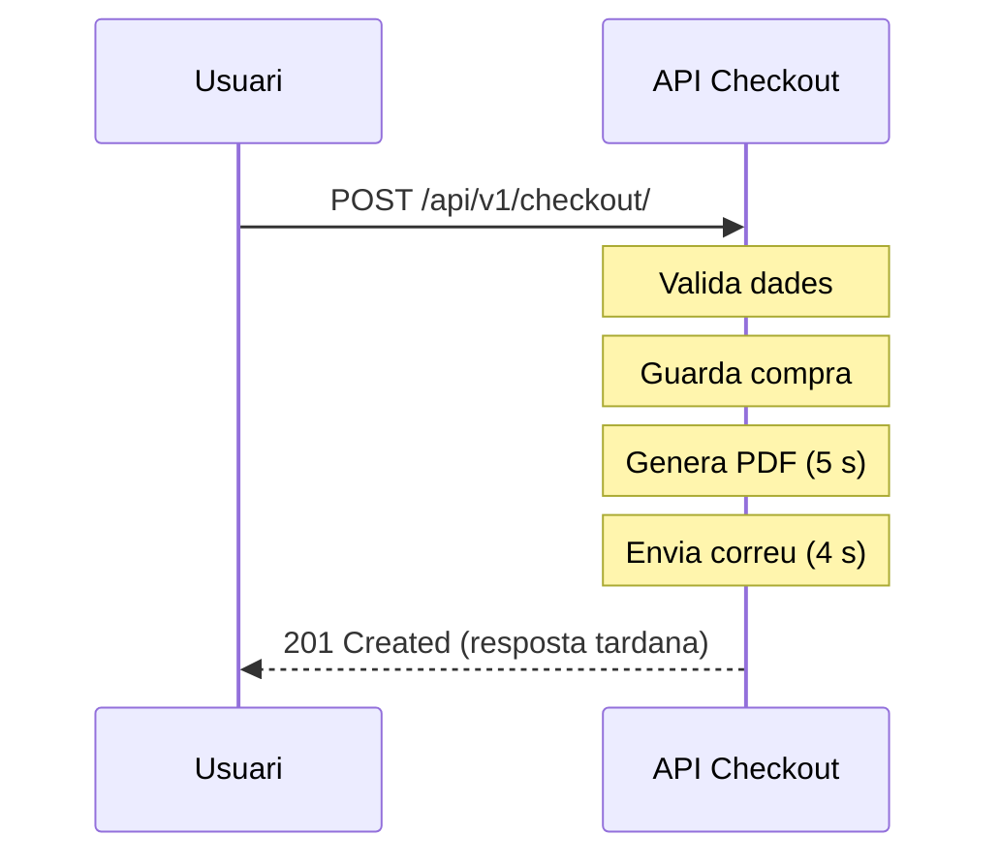

Temps total de resposta: ~10 s. En condicions de càrrega, el servidor pot arribar a esgotar el temps màxim de resposta del proxy (normalment 30 s) i retornar `504 Gateway Timeout`.

**La solució** és retornar la resposta immediatament un cop la compra estigui guardada i delegar les tasques costoses a un procés separat (*worker*) que les executarà en segon pla.

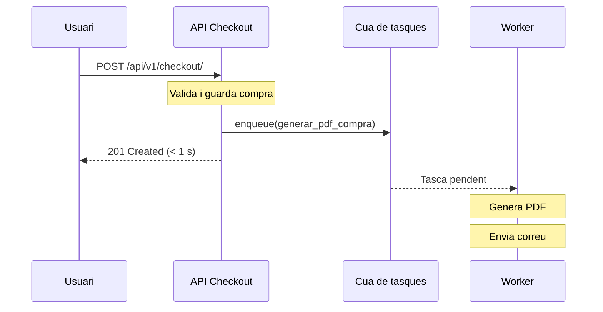

A més d'evitar timeouts, les cues de tasques asíncrones permeten que el backend marqui el ritme de processament i reparteixi millor la càrrega: les operacions costoses no s'han d'executar immediatament dins de cada petició HTTP. Això millora l'ús de recursos i l'escalabilitat quan augmenta el volum de peticions.

També permeten execució **distribuïda**: un únic servidor Django pot encuar feina perquè la consumeixin workers desplegats en màquines diferents (o fins i tot en altres zones/centres). A més, podeu assignar cues específiques a workers amb **hardware especialitzat** (per exemple, GPU per inferència de models, CPU amb molts cores per processament massiu o màquines amb molta RAM per renders/pdfs grans).

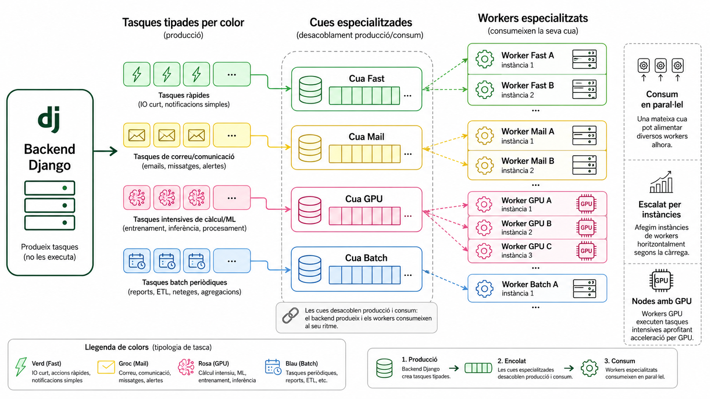

### 1.2. Tasques natives a Django 6

 A partir de Django 6, el framework inclou el mòdul `django.tasks` de forma nativa. Tanmateix, Django **no proporciona cap worker integrat ni un backend de base de dades**; les úniques implementacions incloses (`ImmediateBackend` i `DummyBackend`) són per a desenvolupament i tests. Per a un entorn real (amb una cua persistent a la BD i un worker), cal instal·lar el paquet `django-tasks-db`.

#### Instal·lació del paquet

Per tenir una cua persistent a la base de dades i un worker que l'executi, instal·leu el paquet `django-tasks-db`:

```bash
uv add django-tasks-db
```

Després, configureu el backend de tasques a `settings.py`:

```python
# settings.py
INSTALLED_APPS = [
    # ...
    "django_tasks_db",
]

TASKS = {
    "default": {
        "BACKEND": "django_tasks_db.DatabaseBackend",
        "QUEUES": ["default"],
    }
}
```

#### Crear les migracions de la cua

El backend de base de dades emmagatzema les tasques pendents en una taula pròpia. Genereu i apliqueu les migracions:

```bash
uv run python manage.py migrate
```

### 1.3. Exemple pràctic: PDF + correu (dos patrons)

Per poder provar l'enviament de correu sense enviar cap email real, configurarem el backend de correu de Django en mode consola. Això fa que el contingut del missatge es mostri per terminal.

Primer, afegiu aquesta configuració a `settings.py`:

```python
# settings.py
EMAIL_BACKEND = "django.core.mail.backends.console.EmailBackend"
DEFAULT_FROM_EMAIL = "no-reply@entrades.local"
```

Ara, creeu un fitxer `tasks.py` a l'aplicació de backend. A continuació teniu dos patrons habituals.

#### Patró A: una sola tasca (PDF + correu)

```python
# api/tasks.py
import logging

from django.core.mail import send_mail
from django.tasks import task

logger = logging.getLogger(__name__)


@task
def confirmar_compra_pdf_i_mail(compra_id: int) -> None:
  """Genera el PDF i envia el correu dins la mateixa tasca."""
  logger.info("[TASK] Iniciant confirmació completa per a la compra %d", compra_id)

  # Exemple simplificat: simulació de generació de PDF
  pdf_path = f"/tmp/compra_{compra_id}.pdf"
  logger.info("[TASK] PDF generat a %s", pdf_path)

  send_mail(
    subject=f"Confirmació de compra #{compra_id}",
    message=(
      "Hem rebut la teva compra correctament.\n"
      f"ID de compra: {compra_id}\n"
      f"PDF generat a: {pdf_path}\n"
      "Gràcies per confiar en nosaltres."
    ),
    from_email=None,
    recipient_list=["client@example.com"],
    fail_silently=False,
  )

  logger.info("[TASK] Correu de confirmació enviat per a la compra %d", compra_id)
```

#### Patró B: dues tasques encadenades (PDF -> correu)

```python
# api/tasks.py
import logging

from django.core.mail import send_mail
from django.tasks import task

logger = logging.getLogger(__name__)


@task
def generar_pdf_compra(compra_id: int) -> None:
  """Primer pas: generar PDF; segon pas: encuar l'enviament del correu."""
  pdf_path = f"/tmp/compra_{compra_id}.pdf"
  logger.info("[TASK] PDF generat a %s", pdf_path)

  # Enllaç entre tasques: quan acaba PDF, encua correu
  enviar_mail_compra.enqueue(compra_id, pdf_path)


@task
def enviar_mail_compra(compra_id: int, pdf_path: str) -> None:
  """Segon pas: enviar correu utilitzant la informació del PDF."""
  send_mail(
    subject=f"Confirmació de compra #{compra_id}",
    message=(
      "Hem rebut la teva compra correctament.\n"
      f"ID de compra: {compra_id}\n"
      f"PDF generat a: {pdf_path}\n"
      "Gràcies per confiar en nosaltres."
    ),
    from_email=None,
    recipient_list=["client@example.com"],
    fail_silently=False,
  )
  logger.info("[TASK] Correu enviat per a la compra %d", compra_id)
```

Flux del patró encadenat (`PDF -> correu`):

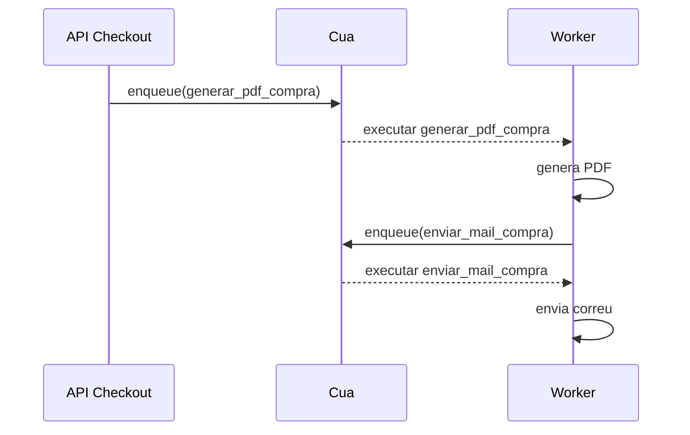

> **Nota important sobre encadenat:** El sistema natiu de tasques de Django no ofereix una API declarativa de cadenes. Si voleu cadenes declaratives, podeu usar eines com Celery (`chain`) o django_q2 (`Chain`). Consulteu la guia [Cadenes de Tasques amb Celery i django_q2](../guies/cadenes_tasques_celery_django_q2.md).

> **Nota:** Amb `console.EmailBackend`, no s'envia cap correu extern: el missatge apareix als logs de la terminal on corre el worker.

### 1.4. Arrancar el *worker* i verificar el comportament

Obriu **tres terminals** en paral·lel per observar el comportament asíncron:

**Terminal 1 – El servidor web:**
```bash
uv run python manage.py runserver
```

**Terminal 2 – El worker de tasques:**
```bash
uv run python manage.py db_worker
```

**Terminal 3 – Django Shell:**
```bash
uv run python manage.py shell
```

Dins del shell, importeu la tasca i encueu-la manualment:

```python
from api.tasks import generar_pdf_compra

generar_pdf_compra.enqueue(1)  # id de compra d'exemple
```

**Observeu:**
* La **Terminal 3** accepta l'encuament immediatament (sense esperar que la tasca acabi).
* La **Terminal 2** mostra primer la generació del PDF i després l'enviament del correu (si feu servir el patró encadenat), o tots dos passos dins la mateixa tasca (si feu servir el patró únic).
* Com que s'utilitza `console.EmailBackend`, el correu complet (assumpte, destinatari i cos) es veu imprès per consola.

Sense el worker, la tasca queda a la cua de la base de dades però **mai s'executa**. Podeu comprovar-ho consultant la taula de tasques a la base de dades.

#### Prova extra: cua pendent i represa del worker

Per veure clarament la diferència entre "encuada" i "executada", feu aquesta prova controlada:

1. **Atureu el worker** (Terminal 2) amb `Ctrl+C`.
2. A la **Terminal 3 (Django Shell)**, encueu dues tasques:

```python
from api.tasks import generar_pdf_compra

generar_pdf_compra.enqueue(1)
generar_pdf_compra.enqueue(1)
```

3. Al mateix shell, **importeu el model de tasques** i consulteu els últims registres:

```python
from django_tasks_db.models import DBTaskResult

for t in DBTaskResult.objects.order_by("-id")[:5]:
  print(
    t.id,
    getattr(t, "status", None),
    getattr(t, "state", None),
    getattr(t, "attempts", None),
  )
```

4. **Arranqueu de nou el worker** a la Terminal 2:

```bash
uv run python manage.py db_worker
```

5. Torneu al shell (Terminal 3) i torneu a consultar els registres del model de tasques per verificar que l'estat ha canviat després de l'execució.

### 1.5. Encuar la tasca des de la vista de checkout

Un cop vist el comportament del worker, modifiqueu la vista `CheckoutView` per encuar la tasca **després del commit** de la transacció. Això evita condicions de cursa i manté la resposta immediata cap al client.

En aquest exemple, enqueuem el **Patró B** (dues tasques encadenades, `PDF -> correu`):

```python
# api/views.py
from django.db import transaction
from rest_framework import status
from rest_framework.exceptions import ValidationError
from rest_framework.permissions import IsAuthenticated
from rest_framework.response import Response
from rest_framework.views import APIView

from .models import Event, Compra, Entrada
from .serializers import CheckoutSerializer, CompraSerializer
from .tasks import generar_pdf_compra   # <-- primer pas de la cadena


class CheckoutView(APIView):
  permission_classes = [IsAuthenticated]

  @transaction.atomic
  def post(self, request):
    serializer = CheckoutSerializer(data=request.data)
    serializer.is_valid(raise_exception=True)
    entrades = serializer.validated_data['entrades']

    compra = Compra.objects.create(usuari=request.user)
    total = 0

    for item in entrades:
      event = Event.objects.select_for_update().get(pk=item['esdeveniment_id'])
      qty = item['quantitat']

      if event.capacitat < qty:
        raise ValidationError(
          {"detail": f"No hi ha prou places per a l'esdeveniment {event.id}"}
        )

      Entrada.objects.create(
        compra=compra,
        esdeveniment=event,
        quantitat=qty,
        preu_unitari=event.preu,
      )
      total += event.preu * qty

    compra.total = total
    compra.save(update_fields=['total'])

    # Encua la primera tasca quan la transaccio s'ha confirmat
    transaction.on_commit(
      lambda: generar_pdf_compra.enqueue(compra.id)
    )

    output = CompraSerializer(compra)
    return Response(output.data, status=status.HTTP_201_CREATED)
```

Si preferiu el **Patró A** (una sola tasca), només cal canviar l'encuament a:

```python
transaction.on_commit(
  lambda: confirmar_compra_pdf_i_mail.enqueue(compra.id)
)
```

Si en comptes del decorador heu utilitzat la transacció amb un bloc with, una alternativa equivalent és:

```python
from django.db import transaction

def post(self, request):
  with transaction.atomic():
    compra = Compra.objects.create(usuari=request.user)
    # ... validacions i creació d'entrades ...

    transaction.on_commit(
      lambda: generar_pdf_compra.enqueue(compra.id)
    )

  output = CompraSerializer(compra)
  return Response(output.data, status=status.HTTP_201_CREATED)
```

### 1.6. Per què la tasca *no* ha d'estar dins de `transaction.atomic`

La vista de checkout utilitza `@transaction.atomic`: això vol dir que **tot el mètode `post` està dins la mateixa transacció** fins al retorn de la resposta.

El problema apareix quan enqueues una tasca abans que la transacció s'hagi confirmat. El worker pot començar a executar-la i intentar llegir dades que encara no són visibles (o que finalment podrien fer rollback).

Si això passa, pots trobar errors com `DoesNotExist`, dades parcials o comportament inconsistent.

Si encuéssim la tasca sense esperar el commit, podria succeir el següent:

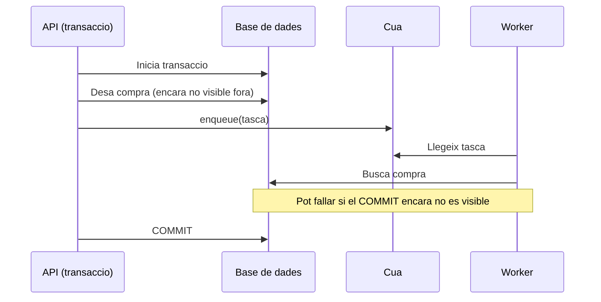

#### Exemple incorrecte

Aquest patró pot executar la tasca massa aviat:

```python
from django.db import transaction

@transaction.atomic
def post(self, request):
    compra = Compra.objects.create(usuari=request.user)
    compra.total = 50
    compra.save(update_fields=["total"])

    # INCORRECTE: la transaccio encara no ha fet COMMIT
    generar_pdf_compra.enqueue(compra.id)

    return Response({"ok": True})
```

#### Exemple correcte

La manera robusta és diferir l'encuament fins que la transacció es confirma amb `transaction.on_commit`:

```python
from django.db import transaction

@transaction.atomic
def post(self, request):
  compra = Compra.objects.create(usuari=request.user)
  compra.total = 50
  compra.save(update_fields=["total"])

  # CORRECTE: nomes s'encua quan el COMMIT s'ha completat
  transaction.on_commit(
    lambda: generar_pdf_compra.enqueue(compra.id)
  )
  return Response({"ok": True})
```

En resum: crea i desa la compra dins de la transacció, i encua la tasca **despres del commit**.

---

## 2. Desplegament amb Docker Compose

### 2.1. Arquitectura del sistema en producció

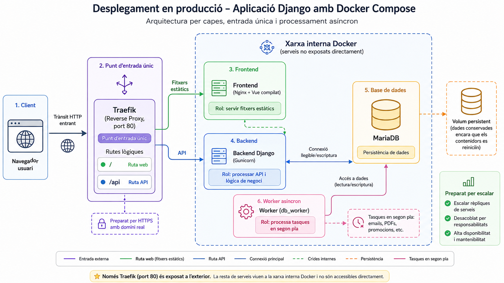

**Definicions dels serveis de l'arquitectura:**

| Servei | Definició funcional |
| :-- | :-- |
| `traefik` | Porta d'entrada HTTP (port 80) i encaminador de peticions cap a frontend o backend. |
| `frontend` | Servei Nginx que publica els fitxers estàtics compilats de Vue. |
| `backend` | Servei Django executat amb Gunicorn per servir l'API. |
| `db` | MariaDB amb persistència de dades d'aplicació i de cua de tasques. |
| `worker` | Procés `db_worker` que consumeix i executa tasques asíncrones des de la BD. |

> ℹ️ **Informació:** En aquest exemple, Traefik està servint només HTTP. Tot i això, Traefik també pot generar certificats TLS de forma automàtica amb Let's Encrypt: https://doc.traefik.io/traefik/https/acme/
>
> Si disposeu d'un domini real, podeu configurar també el port 443 per servir HTTPS (entrypoint `websecure`) i aplicar el router TLS corresponent: https://doc.traefik.io/traefik/routing/entrypoints/

### 2.2. Gunicorn i Nginx: per què no el servidor de Django?

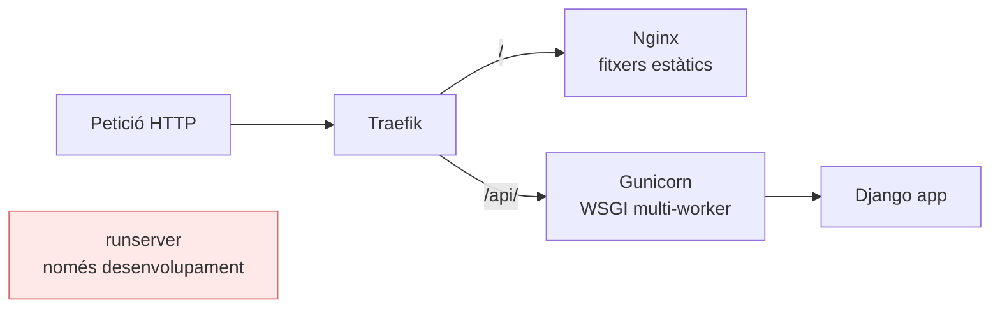

**Definicions clau:**

- `runserver`: servidor de desenvolupament, no pensat per producció.
- `Gunicorn`: servidor WSGI de producció per al backend Django.
- `Nginx`: servidor eficient per fitxers estàtics del frontend.
- `Traefik`: reverse proxy que decideix cap a quin servei va cada ruta.

> ℹ️ **Nota sobre el codi base:** El projecte ja inclou `Dockerfile` tant per al backend com per al frontend, i segueixen aquesta arquitectura. El `Dockerfile` del backend construeix un entorn Python de producció i arrenca Django amb `gunicorn` (via `uv`), mentre que el `Dockerfile` del frontend fa un build multietapa (Node/Vite) i publica els estàtics finals amb Nginx.

### 2.3. Volums i xarxes

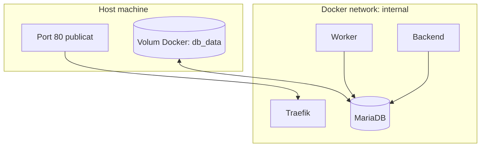

**Definicions clau:**

- `xarxa internal`: xarxa privada Docker on els serveis es resolen pel nom (`db`, `backend`, etc.).
- `port publicat`: únic punt exposat cap a fora (habitualment el 80 de `traefik`).
- `volum`: persistència de dades entre reinicis i recreacions de contenidors.

### 2.4. Definir volums amb mapeig a un directori local

Per facilitar inspecció i còpies de seguretat locals, podeu mapar la BD a un directori del projecte (bind mount). Us mostrem dues opcions:

**Opció A (curta): path relatiu al `compose.yml`**

```yaml
services:
  db:
    image: mariadb:11
    volumes:
      - ./docker-data/mariadb:/var/lib/mysql
```

**Opció B (recomanada quan hi ha problemes amb rutes relatives): bloc `volumes` amb `driver` i `${PWD}`**

```yaml
services:
  db:
    image: mariadb:11
    volumes:
      - db_data_local:/var/lib/mysql

volumes:
  db_data_local:
    driver: local
    driver_opts:
      type: none
      o: bind
      device: ${PWD}/docker-data/mariadb
```

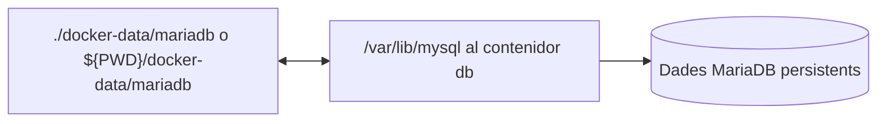

**Recomanació:** creeu el directori abans d'aixecar el compose (`mkdir -p docker-data/mariadb`) i no el pugeu al repositori. Si `${PWD}` no es resol al vostre entorn, substituïu-lo per una ruta absoluta.

### 2.5. Afegir el servei `worker` al `docker-compose.yml`

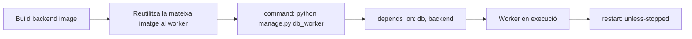

### 2.6. Aixecar l'entorn complet

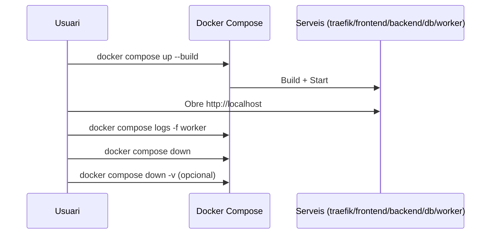

Comandes:

```bash
docker compose up -d --build
docker compose logs -f worker
docker compose down
docker compose down -v
```

> ⚠️ **Compte amb `-v`:** Elimina tots els volums i, per tant, totes les dades de la base de dades.

### 2.7. Validació a les aules Windows (prova de xarxa)

En aquesta validació es comprova, en ordre, que el servei arrenca bé al PC de l'aula, que és accessible localment i que també es publica correctament a la xarxa del laboratori.

Passos recomanats:

1. Arranqueu un `compose` simple (per exemple `traefik + nginx`) al PC de l'aula.
2. Verifiqueu en local que el servei respon a `http://localhost`.
3. Obteniu la IP del PC amb `ipconfig`.
4. Des d'un altre ordinador de la mateixa xarxa, obriu `http://IP_DEL_PC_WINDOWS`.
5. Si respon des del segon equip, la validació de xarxa queda superada.

> [!CAUTION]
> Aquest és el procediment que s'haurà de **seguir obligatòriament** durant la sessió de **proves creuades**. Assegureu-vos de tenir-lo validat i documentat abans de la sessió. Ho teniu definit com a **tasca fora del laboratori**.
> En el Dockerfile del backend hi ha un **ERROR**, cal afegir el Readme.md a la llista de fitxers que es copien, amb el que la línia ```20-21``` ha de quedar així:
> ```bash
> # Copiem els fitxers de dependències
> COPY pyproject.toml uv.lock README.md ./
> ```
---

## 3. Tasques fora del laboratori (Treball Autònom)

### 3.1. Tasques a realitzar

1. **Adaptar la tasca de confirmació per treballar amb dades reals:**

    Continueu usant el `console.EmailBackend` (sense enviar correus reals). Adapteu les tasques de l'apartat 1.3 perquè treballin amb les dades reals de la compra:

    * Llegiu la compra de la base de dades a partir de `compra_id`. Si no existeix, registreu l'error i acabeu la tasca sense llançar una excepció no controlada.
    * Construïu el cos del correu amb les **dades reals**: correu electrònic de l'usuari, llista d'entrades comprades (nom d'esdeveniment, quantitat i preu unitari) i total de la compra.
    * Envieu el correu a l'adreça real de l'usuari que ha fet la compra, no a un destinatari fictici.
    * No cal generar cap PDF.

2. **Tasca de promocions per a esdeveniments amb places disponibles:**

    Definiu una tasca `enviar_promocions` que rebi un llindar `N` (nombre mínim d'entrades disponibles) i enviï un correu de promoció amb els esdeveniments que, a menys de 48 hores de la data, encara tinguin **més de `N` places lliures**.

    El descompte aplicat a cada esdeveniment dependrà del temps restant:
    * **Entre 24 h i 48 h abans**: descompte del **15 %**.
    * **Menys de 24 h abans**: descompte del **30 %**.

    La tasca **no modifica els preus** a la base de dades; simplement calcula el preu promocional per al correu i informa de quins esdeveniments estan afectats.

3. **Preparar l'entorn complet per a la sessió de proves creuades:**
  * Creeu el fitxer `.env` a partir de `env_sample` i aixequeu tots els serveis amb `docker compose up --build` (`traefik`, `frontend`, `backend`, `db`, `worker`).
  * Verifiqueu abans de la sessió que el frontend respon, que l'API funciona i que el worker processa tasques.
  * Deixeu registrat a `docs/index.md` com aixequeu i verifiqueu l'entorn perquè un altre equip pugui reproduir-lo.

4. **Servir els fitxers estàtics del backend des del Nginx del frontend:**
  * Actualment els estàtics del backend no s'estan servint. Modifiqueu els fitxers lliurats perquè el Nginx del frontend també pugui servir els estàtics generats per Django.
  * **Pista:** podeu muntar un mateix volum en dos contenidors diferents (backend i frontend) perquè un generi els estàtics i l'altre els publiqui.
  * Tingueu en compte que probablement caldrà fer alguna acció manual (per exemple, generar estàtics) o bé canviar la forma d'arrencar Django perquè aquest pas quedi integrat.
  * Heu d'explicar aquest punt a `docs/index.md`: què heu canviat, com es generen/serveixen els estàtics i com es valida que funciona.

5. **Preparar la PR setmanal orientada a proves creuades:**
  * Incloeu un resum de funcionalitats i l'estat de l'entorn complet aixecat per a la sessió de proves creuades.
  * Afegiu evidències (captures o logs) de backend, worker i base de dades en funcionament.
  * Documenteu explícitament quins serveis s'han d'arrencar i en quin ordre per passar la prova creuada.


### 3.2. Casos de prova addicionals per al backend

#### Com fer proves de tasques asíncrones

En els tests no volem aixecar un worker real. Django proporciona dos backends alternatius que s'activen amb `@override_settings`:

| Backend | Comportament |
| :-- | :-- |
| `django.tasks.backends.immediate.ImmediateBackend` | Executa la tasca **síncronament** en el mateix procés en cridar `.enqueue()`. Permet verificar el comportament complet de la tasca. |
| `django.tasks.backends.dummy.DummyBackend` | Registra l'encuament però **no executa** la tasca. Permet verificar que s'encua (o no) sense efectes secundaris. |

Per als correus, Django substitueix automàticament el backend pel de memòria (`locmem`) durant els tests. Els missatges enviats queden a `django.core.mail.outbox` i es poden inspeccionar directament.

Exemple mínim:

```python
# api/tests/test_tasks.py
import pytest
from django.core import mail
from django.test import override_settings

from api.tasks import confirmar_compra

IMMEDIATE = {
    "default": {
        "BACKEND": "django.tasks.backends.immediate.ImmediateBackend"
    }
}


@pytest.mark.django_db
@override_settings(TASKS=IMMEDIATE)
def test_confirmar_compra_envia_correu(compra):
    confirmar_compra.enqueue(compra.id)

    # La tasca s'ha executat de forma síncrona: ja hi ha un correu a outbox
    assert len(mail.outbox) == 1
    missatge = mail.outbox[0]

    assert missatge.to == [compra.usuari.email]
    assert f"#{compra.id}" in missatge.subject
    assert str(compra.total) in missatge.body


@pytest.mark.django_db
@override_settings(TASKS=IMMEDIATE)
def test_confirmar_compra_id_inexistent():
    confirmar_compra.enqueue(99999)

    # La tasca ha registrat l'error però no ha llançat cap excepció
    assert len(mail.outbox) == 0
```

> **Nota:** `mail.outbox` es buida automàticament entre tests. No cal fer cap `setUp` manual.

---

**Taula de proves de les tasques asíncrones i promocions**

> **Consells:**
> - Per als tests de checkout i encuament, podeu inspeccionar la taula de tasques de la base de dades o fer servir utilitats de test de `django.tasks` si estan disponibles a la vostra versió.
> - Per als correus, utilitzeu sempre `mail.outbox` per comprovar destinataris i contingut.
> - La tasca de promocions mai ha de modificar el preu real a la base de dades, només el mostra al correu.

| ID  | Què cal provar                                                                 | Resultat esperat                                                                                                 |
|:----|:------------------------------------------------------------------------------|:-----------------------------------------------------------------------------------------------------------------|
| T17 | Checkout correcte encua la tasca de confirmació                               | `201 Created` i la tasca apareix a la taula de la BD                                                             |
| T18 | Rollback per estoc insuficient no encua cap tasca                             | `400 Bad Request` i cap tasca encuada                                                                            |
| T19 | El worker processa la tasca de confirmació i envia el correu correctament     | El log mostra l'execució i el correu es genera amb les dades reals (usuari, entrades, total)                   |
| T20 | La tasca de confirmació amb compra inexistent no falla ni envia correu        | El log mostra l'error controlat i no s'envia cap correu                                                          |
| T21 | El cos del correu inclou totes les entrades de la compra                      | Cada entrada apareix al correu amb nom d'esdeveniment, quantitat i preu unitari                                 |
| T22 | El correu s'envia a l'adreça real de l'usuari                                 | El camp `To:` del correu a la consola coincideix amb `usuari.email`                                              |
| T23 | La tasca de confirmació no llença excepció amb compra inexistent              | No hi ha error del worker ni excepció, només log d'error controlat                                               |
| T24 | Promocions: hi ha esdeveniments a menys de 48 h amb més de `N` places lliures | El correu de promoció apareix a la consola adreçat a tots els usuaris registrats actius                         |
| T25 | Promocions: esdeveniment a menys de 24 h amb suficients places                | El preu promocional al correu és el 70 % del preu original (descompte del 30 %)                                 |
| T26 | Promocions: esdeveniment entre 24 h i 48 h amb suficients places              | El preu promocional al correu és el 85 % del preu original (descompte del 15 %)                                 |
| T27 | Promocions: tots els esdeveniments tenen ≤ `N` places lliures                 | El log mostra cap promoció per enviar i no s'envia cap correu                                                    |
| T28 | Promocions: no hi ha cap usuari registrat amb correu electrònic               | El log mostra l'avís corresponent i la tasca acaba sense enviar cap correu                                       |
| T29 | Promocions: la tasca no modifica els preus de la base de dades                | Després d'executar la tasca, `Esdeveniment.preu` és el mateix que abans                                          |

