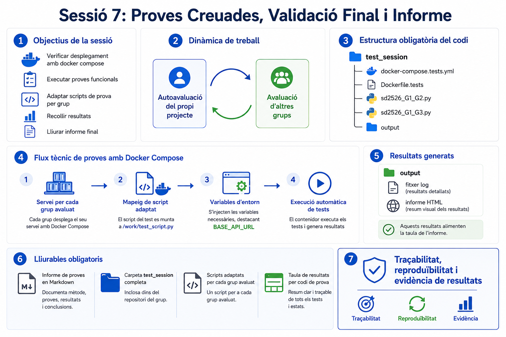

# Sessió 7: Proves Creuades, Validació Final i Informe

Aquesta sessió està orientada a validar el funcionament real de les pràctiques mitjançant **proves creuades entre grups** i una revisió crítica del producte (*betatesting*). L'objectiu no és afegir funcionalitats noves, sinó verificar qualitat, robustesa i desplegament.

**Objectius de la sessió:**

1. Verificar el desplegament complet de cada projecte amb `docker compose`.
2. Executar una bateria mínima de proves funcionals (manuals i automatitzades).
3. Adaptar i executar l'script base de proves [scripts/sd2526_test.py](../scripts/sd2526_test.py) sobre els grups assignats.
4. Documentar els resultats de les proves amb codis de test homogenis.
5. Elaborar i lliurar un informe de proves complet dins del repositori.

**Guies relacionades:**

* 📖 [Plantilla de l'informe de proves creuades (Sessió 7)](../guies/plantilla_informe_proves_creuades_sessio7.md)
* 📖 [Catàleg de proves i criteris d'avaluació (Sessió 7)](../guies/proves_i_criteris_sessio7.md)
* 📖 [Entorns d'Execució: Desenvolupament vs Producció (Docker)](../guies/docker_dev_vs_prod.md)

---

## 1. Dinàmica de la sessió

Cada grup treballarà en dos rols:

1. **Autoavaluació del seu projecte**: revisió de PRs, proves pròpies i estat del desplegament.
2. **Avaluació d'altres grups**: execució de proves sobre el projecte d'altres grups i registre d'incidències.

El flux global de la sessió (rols, execució de proves i recollida d'evidències) es resumeix al diagrama següent:



Per assegurar traçabilitat, els **codis de test** (`T00`, `T01`, ...) ja estan predefinits al catàleg de proves i al material de la sessió. Cada grup ha d'aplicar aquests codis en el registre de resultats i resumir-los en la taula final de l'informe.

## 2. Script base i nomenclatura de lliurament

Es proporciona un script base de referència:

* [scripts/sd2526_test.py](../scripts/sd2526_test.py)
* [scripts/README.md](../scripts/README.md)
* [scripts/docker-compose.tests.yml](../scripts/docker-compose.tests.yml)

La part de codi s'ha d'organitzar obligatòriament amb aquesta estructura, amb `test_session/` com a arrel:

```text
test_session/
   docker-compose.tests.yml
   Dockerfile.tests
   sd2526_G1_G2.py
   sd2526_G1_G3.py
   output/
```

Notes:

1. `docker-compose.tests.yml` ha de definir un servei per cada grup que s'avalua.
2. Cada servei ha de mapar el seu script adaptat a `/work/test_script.py`.
3. `output/` conté els resultats de les execucions (log i informe HTML).

Cada grup haurà d'adaptar-lo per a cada grup que avalua i lliurar-lo amb aquest format de nom:

* `sd2526_G1_G2.py`

on:

* `G1` = codi del grup que avalua (`B01`, `C10`, ...)
* `G2` = codi del grup que s'avalua

Exemple:

* `sd2526_B01_C10.py`

Per a l'execució, s'ha d'utilitzar **Docker Compose**:

1. Definiu un servei per cada grup que s'avalua.
2. A cada servei, mapegeu l'script adaptat corresponent (`sd2526_G1_G2.py`).
3. Configureu les variables d'entorn al `docker-compose.tests.yml` (incloent `BASE_API_URL`; opcionalment `BASE_URL` com a fallback).
4. Genereu fitxers de resultats a `output/` (log i informe HTML) per poder omplir l'informe.

## 3. Validació de desplegament amb Docker Compose

Aquesta sessió exigeix comprovar explícitament el desplegament:

1. Intentar aixecar el sistema de cada grup assignat amb `docker compose`.
2. Verificar si els serveis principals arrenquen correctament (backend, frontend, base de dades i altres serveis definits per cada grup).
3. Registrar el resultat:
   * si s'ha pogut desplegar,
   * si funciona correctament,
   * i quins problemes s'han detectat (si n'hi ha).

Aquest punt és **obligatori** tant a l'autoavaluació com a l'avaluació creuada.

## 4. Lliurables obligatoris

Cada grup ha d'afegir al seu repositori:

1. **Informe de proves** en format Markdown, seguint la plantilla de la guia associada.
2. **Carpeta `test_session/` completa** amb `docker-compose.tests.yml`, `Dockerfile.tests`, scripts adaptats i carpeta `output/`.
3. **Scripts adaptats** de proves creuades amb nom `sd2526_G1_G2.py` (un per cada grup que s'avalua).
4. Resultats resumits per codi de prova a la taula de l'informe.

## 5. Criteris de qualitat de l'informe

L'informe ha de permetre entendre clarament:

1. Quines proves s'han executat i amb quin resultat.
2. Quines incidències s'han detectat i com reproduir-les.
3. Quin és l'estat del desplegament amb `docker compose`.
4. Quines evidències justifiquen l'avaluació final.

---

## PART 6: Treball Autònom (Tancament de pràctica)

Fora de laboratori, cada grup ha de:

1. Completar l'informe amb tots els apartats obligatoris.
2. Revisar i netejar el script `sd2526_G1_G2.py` perquè sigui reproduïble.
3. Afegir conclusions finals i millores prioritzades per al projecte.
4. Deixar constància de l'estat real del desplegament Docker i les limitacions detectades.
